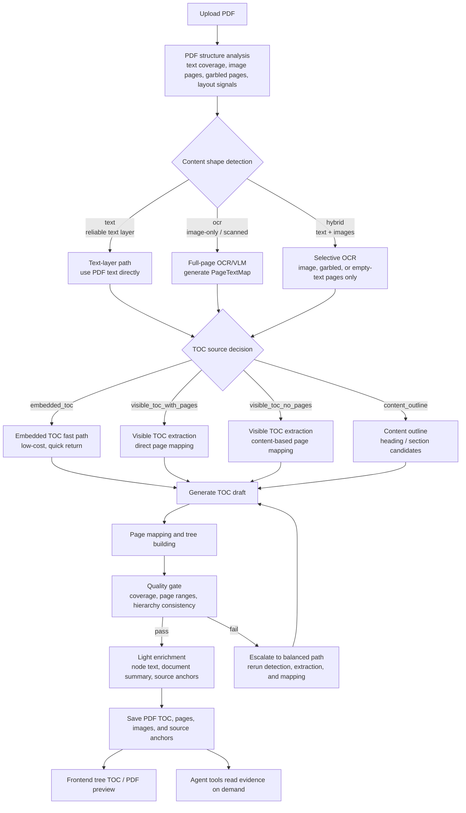
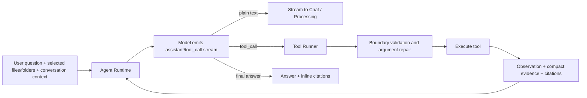

# PageChat

<!-- README-I18N:START -->

**English** | [简体中文](./README.zh-CN.md)

<!-- README-I18N:END -->

PageChat is an AI document workspace for complex document understanding, structured indexing, and source-grounded question answering. Built on top of PageIndex, it extends document format support and adds document library management, visual TOC, OCR/VLM, model provider configuration, web search, citation preview, and an LLM-driven Agent tool loop for verifiable QA over PDFs, scanned files, spreadsheets, slide decks, Word documents, and other knowledge assets.

PageChat is not just “upload a document and retrieve chunks.” It first builds a document structure, then lets the Agent progressively read evidence from folders, TOCs, pages, images, tables, and web sources. The reasoning process is visible, and citations are placed close to the conclusions so users can return to the original source.

## Core Features

- **One-command deployment**: Docker Compose, frontend/backend image builds, and an Nginx entrypoint are included. Start the app first, then configure model providers in the UI.
- **Visual TOC**: Builds tree TOCs, page anchors, node summaries, and source metadata, then renders the structure visually in the frontend.
- **OCR / VLM parsing**: Supports scanned documents, image-only PDFs, and visual chart pages. OCR models are configured by the user.
- **Multi-format support**: Supports PDF, Markdown, TXT, CSV, TSV, XLSX, DOCX, PPTX, and other common formats.
- **Custom models**: Supports one-click multi-provider setup and OpenAI-compatible adapters. QA, parsing, OCR/VLM, and other tasks can use different models.
- **Web search**: Integrates AnySearch to add external web evidence when the user enables it.
- **Trustworthy citations and previews**: Answers can cite documents, pages, table rows, slides, paragraphs, images, or web sources.
- **Visual workspace**: Provides Chat, document management, folder navigation, preview, model settings, and related workspace UI.

## Design Philosophy

Many document QA systems first ask an LLM to rewrite materials into a wiki, summary, or knowledge-base article, and then answer questions from that second-hand generated content. This is convenient, but it can also freeze the model’s omissions, over-compression, and misreadings into a new source of truth. Later answers become hard to audit: did the answer come from the original document, or from an unreliable rewrite?

PageChat treats reliable TOC and source anchors as the first layer of infrastructure. It understands document structure first, preserves pages, sections, tables, images, and OCR sources, and then lets the Agent return to original evidence for each question. OCR is mainly used for indexing, locating, and fallback for non-vision models. If the QA model supports vision, image-based content should be answered from page images or original images, not OCR text alone. The model can summarize and reason, but key claims should map back to specific pages, paragraphs, table ranges, images, or web sources. The goal is not to turn documents into a plausible LLM wiki; it is to keep every answer traceable and source-checkable.

## TOC Construction And Layered Strategy

One important part of PageChat is splitting PDF TOC construction into independent layers: document-shape detection, page-text preprocessing, TOC candidate generation, page mapping, quality gates, and progressive enrichment. Different PDFs do not have to run through the same heavy model chain. Instead, PageChat routes by content shape:

- **Well-structured text PDFs**: Use the PDF text layer, heading rules, embedded TOC, or visible TOC directly. These documents usually need only one low-cost QC/summary LLM call, can skip OCR entirely, and can finish TOC construction in seconds.
- **Image-only or scanned PDFs**: Route to `ocr`, run OCR/VLM on full pages, build page-level text, and then detect TOC pages, extract TOC entries, and map pages.
- **Hybrid PDFs**: Keep the reliable text layer and run OCR only on image pages, garbled pages, or empty-text pages, avoiding full-document OCR cost.
- **Unstable structures**: Try fast/smart paths first. If TOC candidates, page mapping, or quality gates fail, automatically escalate to the balanced path instead of returning a broken tree.

The result is simple PDFs stay fast, visual PDFs remain parseable, hybrid PDFs stay cost-controlled, and complex PDFs get quality fallback. The frontend always sees a unified tree TOC, while the backend can choose different processing routes.



## Agent Architecture

PageChat uses `flat_tool_loop` by default. It is not a fixed stage machine, nor a backend-hardcoded workflow of “plan, retrieve, answer.” It is closer to a Claude Code / Codex-style flat LLM-driven tool loop: the model sees the system prompt, user question, selected document scope, available tools, and previous observations, then decides whether to call a tool or produce an answer. This also leaves room for future extension.



Key Agent design choices:

- **Model-controlled next step**: The backend does not predefine a retrieval stage. The model iterates from observations.
- **Runtime-enforced boundaries**: The runtime handles user isolation, document scope, tool argument repair, web-search permissions, and citation binding.
- **Compact reusable evidence**: Tool results are cached as reusable evidence to reduce repeated reads in the same conversation.
- **Visible process**: Tool calls, processing text, citations, and final answer tokens stream to the frontend over SSE.

## Agent Tool Design

PageChat does not send the whole document library into the model context. It exposes a compact set of bounded tools. Tool results return the information the model needs: summaries, hit locations, citation anchors, and next-step hints rather than large unrelated text dumps.

| Tool | Main purpose | Typical return |
| --- | --- | --- |
| `view_folder_structure` | View the current user's folder tree | Folder hierarchy, file counts, browsable locations |
| `browse_documents` | Browse or search documents in the current scope | Document/folder list, status, summary, candidate `doc_id` |
| `get_document_structure` | Read the full deep TOC and document organization | Section tree, page ranges, node summaries, structured anchors |
| `search_within_document` | Keyword location inside one document | Hit pages, snippets, match reason, suggested pages to read |
| `get_page_content` | Read page text or structured content | Page text, OCR snippets, table/paragraph citations |
| `get_page_image` | Fetch full-page visual evidence | Page image reference, page number, evidence for vision models |
| `get_document_image` | Fetch indexed charts or embedded images | Image reference, source page, description, citation anchor |
| `aggregate_tables` | Run lightweight aggregation over table documents | Sheet, columns, statistics, row-range citations |
| `web_search` | Use AnySearch for external information | Web title, snippet, URL, web citation source |

Tool usage follows several principles:

- **Structure before detail**: Overview questions should read TOC first; specific factual questions should then read pages, images, or tables.
- **Citations bind to sources**: Citations should point to documents, pages, images, table ranges, or web URLs rather than arbitrary chunk numbers.
- **Image evidence first**: If the QA model supports vision, image pages, charts, and scanned pages should use page images or original images directly. OCR text is mainly for indexing and fallback for non-vision models.
- **User scope first**: When the user selects files or folders, the Agent should stay within that scope and not read other users' or unrelated content.
- **Explicit web search**: `web_search` is exposed only when the user enables it or the question clearly requires external real-time information.

## Project Structure

```text
PageChat
+-- backend/                 FastAPI backend service
|   +-- app/api/             Auth, Chat, Documents, Folders, Settings API
|   +-- app/agent/           Agent runtime, tool loop, event protocol, boundary policy
|   +-- app/models/          SQLite table definitions, migrations, Pydantic schemas
|   +-- app/prompts/         Agent and PageIndex prompts
|   +-- app/services/        Document, index, OCR, model, search, preview services
+-- frontend/                Vue 3 + TypeScript frontend
|   +-- src/components/      Chat, document, folder, preview, settings components
|   +-- src/stores/          Chat, Document, Folder, User Pinia stores
|   +-- src/views/           Chat, document management, login, settings views
|   +-- src/utils/           Citation, range, export, PDF preview utilities
+-- deploy/nginx/            Docker frontend entrypoint config
+-- scripts/                 Local development and deployment verification scripts
+-- docker-compose.yml       One-command frontend/backend startup with persistent volumes
```

The backend uses SQLite by default to store users, document metadata, conversation history, run events, evidence, and citation records. In Docker deployments, runtime data is stored in the `pagechat-data` and `pagechat-logs` volumes.

## One-Command Deployment

### 1. Clone the project

```bash
git clone https://github.com/VT777/PageChat.git
cd PageChat
```

### 2. Copy configuration

```bash
cp .env.example .env
```

> [!TIP]
> PageChat does not require `LLM_API_KEY` before startup. You can start the service first, then add model providers, API keys, QA models, and OCR/VLM models in the settings UI.

For production or public deployments, set at least:

```env
APP_ENV=production
JWT_SECRET=replace-with-a-long-random-secret
MODEL_SETTINGS_SECRET=replace-with-another-long-random-secret
PAGECHAT_HTTP_PORT=8080
```

### 3. Start

```bash
docker compose up -d --build
```

Windows users can also run:

```bat
start-pagechat-docker.bat
```

URLs:

- Frontend: <http://localhost:8080>
- Backend health check: <http://localhost:8000/health>
- API docs: <http://localhost:8000/docs>

### 4. Logs and shutdown

```bash
docker compose logs -f
docker compose down
```

Windows helper scripts:

```bat
logs-pagechat-docker.bat
stop-pagechat-docker.bat
```

## Local Development

Backend:

```bash
cd backend
python -m venv venv
venv\Scripts\activate
pip install -r requirements.txt
python -m uvicorn app.main:app --host 127.0.0.1 --port 8000 --reload
```

Frontend:

```bash
cd frontend
npm install
npm run dev
```

Local development URLs:

- Frontend: <http://localhost:5173>
- Backend: <http://localhost:8000>

## Configuration

After login, most product settings can be configured in the UI:

- Model providers and API keys
- Available models, capabilities, and disabled status
- QA model, parsing model, OCR/VLM model
- OCR concurrency and parsing settings
- AnySearch web search
- Interface language

Environment variables are mainly used for service startup, secrets, ports, and optional fallback. The default product flow is: start the service first, then configure models in the UI.

## Supported File Formats

| Format | Extensions | Notes |
| --- | --- | --- |
| PDF | `.pdf` | Page anchors, PDF preview, page images, OCR/VLM |
| Markdown | `.md`, `.markdown` | Heading structure, line anchors |
| Text | `.txt` | Line ranges and lightweight outline |
| Tables | `.csv`, `.tsv`, `.xlsx` | Sheets, columns, row ranges, table aggregation |
| Word | `.docx` | Headings, paragraphs, document structure |
| PowerPoint | `.pptx` | Slide-level anchors |

## Testing

Backend tests:

```bash
cd backend
python -m pytest
```

Frontend tests and build:

```bash
cd frontend
npm test
npm run build
```

Docker deployment verification:

```bash
python scripts/verify_docker_deploy.py
```

## Roadmap

- Stabilize parsing quality for Word, PowerPoint, Excel, Markdown, plain text, scanned documents, and other common formats.
- Support custom Skills so the Agent can perform TOC parsing and structured understanding for more file types.
- Continue improving model-provider capability detection, OCR/VLM routing, and citation experience.

## Acknowledgements

Thanks to [VectifyAI/PageIndex](https://github.com/VectifyAI/PageIndex) for providing the algorithmic foundation for long-document understanding and TOC construction. PageChat's document-structuring capability benefits from this work.
