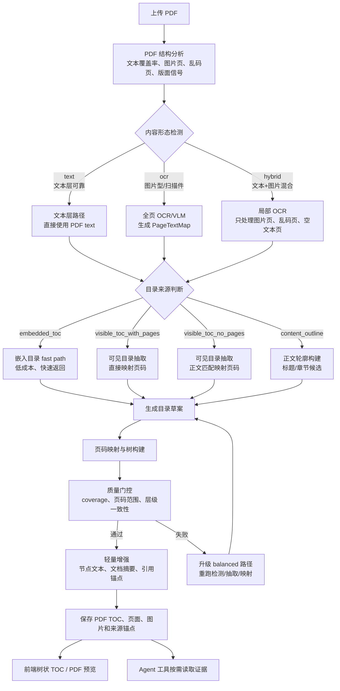
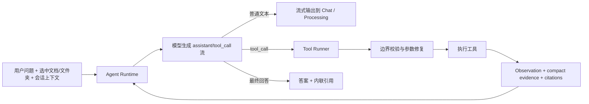

# PageChat

<!-- README-I18N:START -->

[English](./README.md) | **简体中文**

<!-- README-I18N:END -->

PageChat 是一个面向复杂文档理解、结构化索引和可信问答的 AI 文档工作台。它以 PageIndex 的文档结构化能力为基础，进行了文档格式扩展，并支持文档库管理、可视化 TOC、OCR/VLM、模型供应商配置、网络搜索、引用预览和 LLM-driven Agent 工具循环，让用户可以围绕 PDF、扫描件、表格、演示文稿、Word 文档等资料进行可核查的问答。

PageChat 不只是“上传文档后切块检索”。它会先构建文档结构，再让 Agent 按文件夹、目录、页面、图片、表格和网页来源逐步读取证据，推理过程清晰可见，最后在回答中把引用贴近结论展示，便于用户回到原文核查。

## 核心能力

- **一键部署**：内置 Docker Compose、前后端镜像构建和 Nginx 入口，启动后即可进入界面配置模型供应商。
- **可视化 TOC**：构建树状目录、页码锚点、节点摘要和来源元数据，前端可视化展示文档结构。
- **OCR / VLM 解析**：支持扫描件、图片型 PDF、图表页等视觉内容；OCR 模型由用户在设置中配置。
- **多格式适配**：支持 PDF、Markdown、TXT、CSV、TSV、XLSX、DOCX、PPTX 等常见资料格式。
- **模型自定义**：支持多供应商一键配置，以及 OpenAI-compatible 适配，可按问答、解析、OCR/VLM 等任务自定义模型。
- **网络搜索**：集成 AnySearch，在用户开启时为需要外部信息的问题补充网页证据。
- **可信引用和预览**：回答引用可绑定到具体文档、页码、表格行、幻灯片、段落、图片或网页来源。
- **可视化界面**：提供包含 Chat、文档管理、文件夹导航、预览、模型设置等功能的可视化工作台。

## 设计理念

很多文档问答系统会先让 LLM 把资料改写成 wiki、摘要或知识库条目，再基于这些二次生成内容回答问题。这样做很轻便，但也容易把模型的概括、遗漏和误读固化成新的信息源，后续问答很难判断答案到底来自原文，还是来自一次不可靠的重写。

PageChat 更倾向于把可靠 TOC 和来源锚点作为第一层基础设施：先理解文档结构，保留页码、章节、表格、图片和 OCR 来源，再让 Agent 按问题回到原文证据中取材。OCR 主要用于索引、定位和非视觉模型的 fallback；如果问答模型支持 vision，图片型内容应直接回到页面图片或原图进行回答，而不是只依赖 OCR 文本。模型可以总结和推理，但关键结论必须能落回具体页面、段落、表格范围、图片或网页来源。这也是 PageChat 的核心竞争力：不是让文档变成一份“看起来很懂”的 LLM wiki，而是让每次回答都尽量有路径可追、有来源可查。

## TOC 构建流程与分层策略

PageChat 重要工作之一，是把 TOC 构建拆成“文档形态检测、文本层预处理、候选目录生成、页码映射、质量门控、渐进增强”几个独立层。不同文档不会被迫走同一条重模型链路，而是按内容形态分流：

- **结构良好的文本型文档**：直接使用 PDF 文本层、标题规则、嵌入目录或可见目录；通常只需要一次低成本质检/摘要型 LLM，甚至可以完全跳过 OCR，秒级完成 TOC 构建。
- **图片型或扫描型文档**：先识别为 `ocr` 路径，对全页执行 OCR/VLM，获得页面级文本后再进入目录检测、目录抽取和页码映射。
- **混合型文档**：保留可靠文本层，只对图片页、乱码页、空文本页做局部 OCR，避免为整份文档支付 OCR 成本。
- **结构不稳定的文档**：先尝试 fast/smart 路径；如果目录候选、页码映射或质量门控失败，再自动升级到 balanced 路径，而不是把失败结果直接交给用户。

这种分层的效果是：简单文档快，视觉文档可处理，混合文档成本可控，复杂文档有质量兜底。前端展示的是统一的树状 TOC，但后端实际会根据文档形态选择不同的处理链路。



## Agent 架构

PageChat 默认使用 `flat_tool_loop`。它不是固定阶段机，也不是后端硬编码 “先 plan 再查再答” 的工作流，而是更接近 Claude Code / Codex 风格的扁平 LLM-driven tool loop：模型看到系统提示、用户问题、当前文档范围、可用工具和历史 observation，然后自己决定调用工具或输出答案，也为后续拓展留出空间。



Agent 的关键设计：

- **主动权交给模型**：后端不预设固定检索阶段，模型可根据 observation 迭代决策。
- **边界由运行时兜底**：运行时负责用户隔离、文档范围、工具参数修复、网络搜索开关和引用绑定。
- **证据紧凑复用**：工具结果会被缓存成可复用 evidence，减少同一会话中重复读取。
- **过程可视化**：工具调用、processing 文本、引用和最终回答通过 SSE 流式返回前端。

## Agent 工具设计

PageChat 不会把完整文档库一次性塞进模型上下文，而是提供一组边界清晰、输出紧凑的工具。工具结果会尽量返回模型需要的信息：摘要、命中位置、引用锚点、下一步建议，而不是大段无关原文。

| 工具 | 主要用途 | 典型返回 |
| --- | --- | --- |
| `view_folder_structure` | 查看当前用户可访问的文件夹树 | 文件夹层级、文件数量、可继续浏览的位置 |
| `browse_documents` | 在当前范围内浏览或搜索文档 | 文档/文件夹列表、状态、摘要、候选 doc_id |
| `get_document_structure` | 读取完整深层 TOC 和文档组织 | 章节树、页码范围、节点摘要、结构化锚点 |
| `search_within_document` | 文档内关键词定位 | 命中页、片段、匹配原因、建议读取页面 |
| `get_page_content` | 读取页面文本或结构化内容 | 页面文本、OCR 片段、表格/段落引用 |
| `get_page_image` | 获取整页视觉证据 | 页面图片引用、页码、适合视觉模型查看的证据 |
| `get_document_image` | 获取索引中记录的图表或嵌入图片 | 图片引用、来源页、说明和引用锚点 |
| `aggregate_tables` | 对表格文档做轻量聚合 | 工作表、列、统计结果和行范围引用 |
| `web_search` | 调用 AnySearch 获取外部信息 | 网页标题、摘要、URL、网页引用来源 |

工具链路遵循几个原则：

- **先结构、后细节**：概览类问题优先读取 TOC；具体事实再读取页面、图片或表格。
- **引用绑定到来源**：引用不是按 chunk 编号展示，而是尽量绑定到文档、页码、图片、表格范围或网页 URL。
- **图片证据优先**：当问答模型支持 vision 时，图片页、图表和扫描页应直接读取页面图片或原图；OCR 文本主要用于索引定位，以及非视觉模型的 fallback。
- **用户范围优先**：用户指定文件或文件夹后，Agent 应在该范围内行动，不应随意读取其他用户或其他范围内容。
- **网络搜索显式可控**：只有用户开启或问题明确需要外部实时信息时，才暴露并使用 `web_search`。

## 项目结构

```text
PageChat
+-- backend/                 FastAPI 后端服务
|   +-- app/api/             Auth、Chat、Documents、Folders、Settings API
|   +-- app/agent/           Agent runtime、工具循环、事件协议、边界策略
|   +-- app/models/          SQLite 表结构、迁移和 Pydantic Schema
|   +-- app/prompts/         Agent 和 PageIndex 提示词
|   +-- app/services/        文档、索引、OCR、模型、搜索、预览等业务服务
+-- frontend/                Vue 3 + TypeScript 前端
|   +-- src/components/      Chat、文档、文件夹、预览、设置等组件
|   +-- src/stores/          Chat、Document、Folder、User 等 Pinia 状态
|   +-- src/views/           聊天、文档管理、登录、设置等页面
|   +-- src/utils/           引用、范围、导出、PDF 预览等工具函数
+-- deploy/nginx/            Docker 前端入口配置
+-- scripts/                 本地开发和部署验证脚本
+-- docker-compose.yml       一键拉起前后端和持久化数据卷
```

后端默认使用 SQLite 保存用户、文档元数据、会话历史、运行事件、证据和引用信息。Docker 部署时，运行数据保存在 `pagechat-data` 和 `pagechat-logs` volume 中。

## 一键部署

### 1. 克隆项目

```bash
git clone https://github.com/VT777/PageChat.git
cd PageChat
```

### 2. 复制配置

```bash
cp .env.example .env
```

> [!TIP]
> PageChat 不要求启动前必须配置 `LLM_API_KEY`。你可以先拉起服务，再进入设置界面添加模型供应商、API Key、问答模型和 OCR/VLM 模型。

生产或公网部署前，请至少设置：

```env
APP_ENV=production
JWT_SECRET=replace-with-a-long-random-secret
MODEL_SETTINGS_SECRET=replace-with-another-long-random-secret
PAGECHAT_HTTP_PORT=8080
```

### 3. 启动

```bash
docker compose up -d --build
```

Windows 用户也可以直接运行：

```bat
start-pagechat-docker.bat
```

访问地址：

- 前端入口：<http://localhost:8080>
- 后端健康检查：<http://localhost:8000/health>
- API 文档：<http://localhost:8000/docs>

### 4. 查看日志和停止

```bash
docker compose logs -f
docker compose down
```

Windows 辅助脚本：

```bat
logs-pagechat-docker.bat
stop-pagechat-docker.bat
```

## 本地开发

后端：

```bash
cd backend
python -m venv venv
venv\Scripts\activate
pip install -r requirements.txt
python -m uvicorn app.main:app --host 127.0.0.1 --port 8000 --reload
```

前端：

```bash
cd frontend
npm install
npm run dev
```

本地开发访问：

- 前端：<http://localhost:5173>
- 后端：<http://localhost:8000>

## 配置说明

登录后，大部分产品配置都可以在设置界面完成：

- 模型供应商和 API Key
- 可用模型列表、模型能力和禁用状态
- 问答模型、解析模型、OCR/VLM 模型
- OCR 并发和解析设置
- AnySearch 网络搜索
- 界面语言

环境变量主要用于服务启动、密钥、端口和可选 fallback。默认产品路径是：先启动服务，再在 UI 中配置模型。

## 支持的文件格式

| 格式 | 扩展名 | 说明 |
| --- | --- | --- |
| PDF | `.pdf` | 页码锚点、PDF 预览、页面图片、OCR/VLM |
| Markdown | `.md`, `.markdown` | 标题结构、行号锚点 |
| 文本 | `.txt` | 行范围和轻量目录 |
| 表格 | `.csv`, `.tsv`, `.xlsx` | 工作表、列、行范围和表格聚合 |
| Word | `.docx` | 标题、段落和目录结构 |
| PowerPoint | `.pptx` | 幻灯片级锚点 |

## 测试

后端测试：

```bash
cd backend
python -m pytest
```

前端测试和构建：

```bash
cd frontend
npm test
npm run build
```

Docker 部署验证：

```bash
python scripts/verify_docker_deploy.py
```

## 后续方向

- 稳定 Word、PowerPoint、Excel、Markdown、纯文本、扫描件等常见格式的解析质量。
- 支持自定义 Skill，让 Agent 能针对更多文件类型执行 TOC 解析和结构化理解。
- 继续完善模型供应商能力识别、OCR/VLM 路由和引用体验。

## 特别鸣谢

感谢 [VectifyAI/PageIndex](https://github.com/VectifyAI/PageIndex) 提供长文档理解与 TOC 构建的算法基础。PageChat 的文档结构化能力受益于这一工作。
