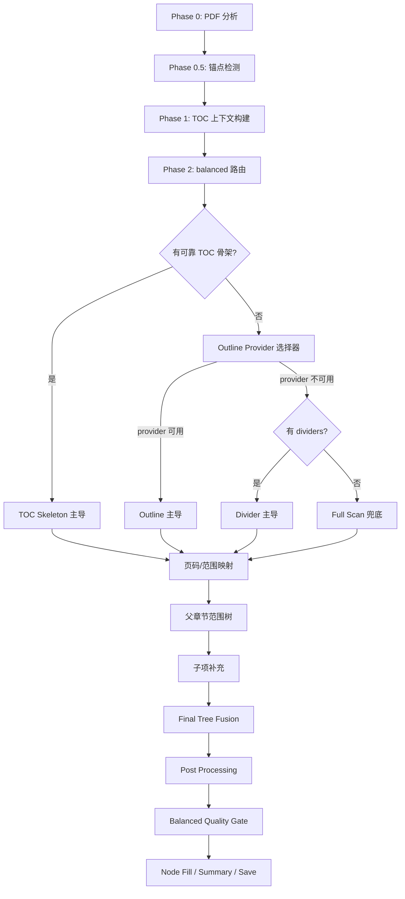
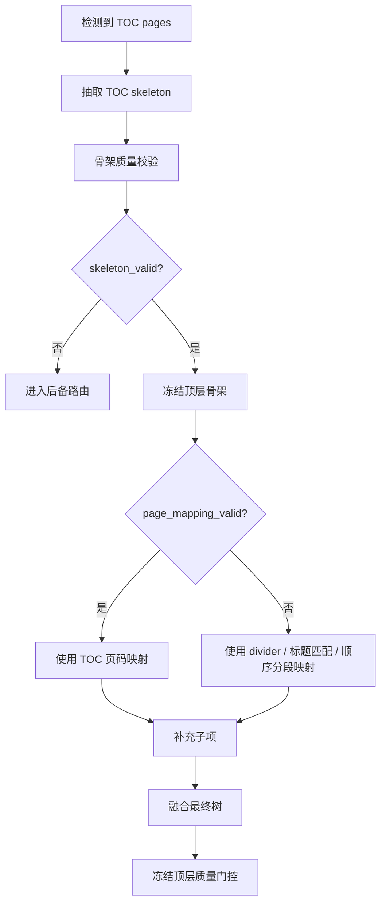

# Balanced TOC Architecture v4.2

## 1. 目标和范围

本文档定义 PageIndex 在 `balanced` 模式下的 TOC 构建架构。

核心目标：

- 目录页存在且骨架可信时，无论目录页是否带页码，都必须被用于最终 TOC 骨架。
- `divider`、正文标题、VLM 全文扫描只用于补充页码、范围和子项，不得覆盖已确认的目录页顶层骨架。
- `balanced` 内部只做一次目录页检测、一次锚点检测，并复用统一上下文，避免新旧流程重复检测和互相 fallback。
- 保留已有的专项分支能力，包括 `text_heading`、`slide_outline`、`agenda_outline`、图目录/表目录辅助目录。

本文档只覆盖 `balanced` 管线内的设计。`fast` 模式、批量上传队列、摘要生成、搜索索引构建不在本次架构调整范围内。

## 2. 设计原则

1. 先确定权威骨架，再映射页码，再补充细节。
2. 目录页骨架质量和页码质量必须分开判断。
3. 每个阶段只负责一种职责，不在后处理阶段重新决定 TOC 顶层结构。
4. 任何分支产生的结构都必须进入统一的树融合和质量门控。
5. 如果 `top_level_frozen=True`，后续阶段不得新增、删除、替换或重排顶层章节。
6. 没有可用目录页骨架时，才允许 `divider` 或全文扫描主导顶层结构。
7. Provider 只负责产生候选骨架或候选证据，不直接生成最终树。
8. 分类依据是页面在文档结构中的语义角色，而不是页面标题里是否出现“目录”“提纲”“章节”等关键词。

## 2.1 工程架构约束

本架构后续开发必须满足低耦合、高内聚、可扩展和可维护要求。

### 2.1.1 低耦合要求

模块之间只能沿单向依赖链调用：

```text
EvidenceClassifier
  -> SkeletonExtractor / OutlineProvider
  -> ProviderSelector
  -> PageMapper
  -> Parent TreeFusion
  -> ChildExpander
  -> Final TreeFusion
  -> PostProcessing
  -> QualityGate
```

禁止反向依赖：

- Provider 不依赖 PostProcessing。
- Provider 不直接调用 TreeFusion。
- PageMapper 不重新检测 TOC 页。
- PostProcessing 不重新选择 provider。
- QualityGate 不重新抽取内容。
- Node Fill、Summary、Save 不参与 TOC 路由判断。

### 2.1.2 高内聚要求

每个模块只处理一种问题：

| 模块 | 唯一职责 |
| --- | --- |
| `EvidenceClassifier` | 从页面、书签、链接、文本中识别结构证据 |
| `SkeletonExtractor` | 将可靠结构化来源规范化为 `TocSkeletonContext` |
| `OutlineProvider` | 从非正式线索生成候选骨架 |
| `ProviderSelector` | 在候选骨架之间做可解释选择 |
| `PageMapper` | 将骨架节点映射到物理页范围 |
| `ChildExpander` | 为已选骨架补充子项 |
| `TreeFusion` | 融合骨架、范围和子项，生成树 |
| `PostProcessing` | 清洗树、修 range、保留辅助目录 |
| `QualityGate` | 保存前做硬性结构校验 |

如果一个函数同时做“检测、抽取、映射、融合、后处理”中的两种以上职责，应拆分。

### 2.1.3 可扩展要求

新增一种文档类型时，只允许扩展以下位置：

- 新增或增强 `EvidenceClassifier`。
- 新增一个 `OutlineProvider`。
- 新增一个 `SkeletonExtractor` adapter。
- 新增一个 `PageMapper` 策略。
- 新增对应测试样例。

不允许为了新文档类型新增一条绕过主流程的独立 pipeline。

### 2.1.4 可维护要求

所有分支都必须输出 canonical 结构：

- 结构化骨架源输出 `TocSkeletonContext`。
- 非正式 outline 输出 `OutlineCandidate`。
- 页码映射输出 `MappedOutline`。
- 树融合输出统一 `tree`。

后续阶段只消费 canonical 结构，不消费 extractor 的私有字段。私有字段只能作为 debug metadata 保存，不得成为下游逻辑依赖。

## 3. balanced 总体流程



工程实现采用“先父范围，后子项”的语义：`PageMapper` 先生成稳定父章节范围，`TreeFusion` 先形成父章节范围树，`ChildExpander` 只能在这些父范围内补子项，最后再做一次 child-only fusion。这样子项扩展器有明确边界，不会越界挂载或重建顶层。

## 4. 统一上下文

### 4.1 BalancedContext

`balanced` 内所有阶段共享同一个上下文，避免重复检测。

```python
BalancedContext = {
    "page_count": 43,
    "text_coverage": 0.30,
    "is_image_only_pdf": False,
    "is_garbled_pdf": True,
    "page_texts": [...],
    "page_list": [...],

    "anchors": {
        "toc_pages": [2],
        "chapter_dividers": [5, 13, 25, 35, 41],
        "first_content_page": 3,
        "confidence": "anchor"
    },

    "toc_skeleton": None,

    "route": {
        "balanced_path": "visual",
        "selected_branch": None,
        "reasons": []
    },

    "state": {
        "top_level_frozen": False,
        "range_locked": False,
        "children_locked": False,
        "range_mapped": False,
        "children_expanded": False,
        "allow_child_expansion": True,
        "allow_top_level_regroup": True,
        "tree_complete": False,
        "needs_repair": False
    }
}
```

### 4.2 TocSkeletonContext

目录页抽取结果必须保存为正式骨架上下文。

```python
TocSkeletonContext = {
    "items": [
        {"structure": "1", "title": "全球人工智能技术发展洞察", "level": 1},
        {"structure": "2", "title": "AI十大行业技术应用需求洞察", "level": 1},
        {"structure": "3", "title": "全球人工智能技术应用突破奖", "level": 1},
        {"structure": "4", "title": "全球人工智能技术应用未来趋势", "level": 1}
    ],
    "source": "toc_page_visual | toc_page_text | bookmark_outline | link_outline | code_toc",
    "toc_pages": [2],
    "skeleton_valid": True,
    "page_mapping_valid": False,
    "hierarchy_valid": False,
    "has_page_numbers": False,
    "authoritative_top_level": True,
    "confidence": 0.90
}
```

`skeleton_valid=True` 表示标题骨架可用。它不要求目录页有页码。

`page_mapping_valid=True` 表示目录页中的页码可直接或经过稳定 offset 映射到物理页。

`authoritative_top_level=True` 表示最终 TOC 顶层必须来自该骨架。

`TocSkeletonContext` 不只表示视觉目录页，也表示所有“结构化骨架源”的 canonical 输出。可靠 PDF outline、书签、链接目录、代码目录都应先规范化为该契约，再进入后续映射和融合流程。这样可以避免书签、目录页、文本目录各自拥有一套后处理逻辑。

### 4.3 OutlineCandidate

非正式 outline provider 必须输出 `OutlineCandidate`。

```python
OutlineCandidate = {
    "source": "slide_outline | agenda_outline | text_heading | divider_outline | running_header | visual_layout",
    "items": [...],
    "confidence": 0.0,
    "evidence_type": "page_title | agenda_page | text_heading | divider | header_footer | visual_layout",
    "coverage": 0.0,
    "granularity": "chapter | section | page",
    "top_level_frozen": False,
    "allow_child_expansion": True,
    "mapping_strategy": "page_title | sequence | divider | direct | estimated",
    "risk_flags": [],
    "debug": {}
}
```

`OutlineCandidate` 不是最终树。它只能进入 `ProviderSelector` 和 `PageMapper`。

### 4.4 MappedOutline

页码映射后输出 `MappedOutline`。

```python
MappedOutline = {
    "source": "toc_page_visual | bookmark_outline | slide_outline | text_heading | divider_outline",
    "items": [
        {
            "structure": "1",
            "title": "章节标题",
            "level": 1,
            "start_index": 5,
            "end_index": 12,
            "mapping_confidence": 0.85,
            "evidence_pages": [5]
        }
    ],
    "range_mapped": True,
    "mapping_strategy": "toc_page_offset | title_match | divider_sequence | direct",
    "mapping_quality": 0.0,
    "debug": {}
}
```

### 4.4.1 页码与范围契约

所有 TOC 管线必须使用同一套页码语义，禁止在 mapper、fusion、前端展示和引用定位之间隐式转换。

硬性约定：

- `start_index` / `end_index` 使用 1-based PDF 物理页号。
- `start_index` / `end_index` 都是 inclusive。
- `toc_pages`、`evidence_pages`、`anchor_pages`、`page` 字段与 `start_index` 使用同一索引体系。
- 文档印刷页码只能保存为 `printed_page` 或 `logical_page`，不能写入 `start_index` / `end_index`。
- `end_index` 为空时只能出现在中间候选；进入最终树前必须补齐。
- 子节点范围必须完全落在父节点 `[start_index, end_index]` 内。
- 标题匹配使用 `normalized_title`，最终展示保留 `title` 原文。
- 每个最终节点必须有稳定 `id`，推荐由 `doc_id + source + normalized_title + start_index + level` 派生。

### 4.4.2 标题字段契约

```python
TitleFields = {
    "title": "原始展示标题",
    "normalized_title": "用于匹配、去重和质量判断的规范化标题",
    "raw_title": "抽取器原始输出，可选",
    "structure": "1.2 或 第二章，可选"
}
```

`normalized_title` 只能用于内部判断，不能替代用户看到的 `title`。

### 4.5 BuildState

整个 balanced 构建过程需要维护显式状态，禁止用单个 `toc_frozen` 或 `skeleton_frozen` 表达所有冻结语义。

```python
BuildState = {
    "skeleton_source": "toc_page_visual | bookmark_outline | text_heading | slide_outline | divider_outline | full_scan",
    "top_level_frozen": False,
    "top_level_source": None,
    "range_locked": False,
    "children_locked": False,
    "range_mapped": False,
    "children_expanded": False,
    "allow_top_level_regroup": True,
    "allow_child_expansion": True,
    "allow_auxiliary_catalogs": True,
    "tree_complete": False,
    "needs_repair": False,
    "repair_actions": []
}
```

状态语义：

- `top_level_frozen=True` 只表示顶层章节标题和顺序不可被替换，不表示整棵树完整。
- `range_locked=True` 表示页码范围已经通过质量门控，后处理只能做局部安全修正。
- `children_locked=True` 表示子项已经通过质量门控，后续阶段不能再增删子项。
- `allow_child_expansion=True` 表示可以在既有父章节范围内补子项。
- `tree_complete=True` 表示结构粒度和范围都通过最终质量门控。
- `needs_repair=True` 表示可以保存候选结果，但必须在 UI/日志/调试信息中暴露质量问题。

兼容旧字段时，`skeleton_frozen` 只能作为 `top_level_frozen` 的历史别名，不得再表示“目录树完整”。

### 4.6 最终 Tree Node Schema

最终保存、前端展示、摘要、引用定位和搜索索引只能消费统一节点 schema。

```python
TreeNode = {
    "id": "stable-node-id",
    "title": "展示标题",
    "normalized_title": "匹配标题",
    "structure": "1.2",
    "level": 1,
    "start_index": 5,
    "end_index": 12,
    "children": [],
    "source": "toc_page_visual | text_heading | visual_page_outline | auxiliary_catalog",
    "evidence_pages": [5],
    "mapping_confidence": 0.85,
    "title_confidence": 0.90,
    "needs_repair": False,
    "repair_reasons": [],
    "is_auxiliary": False,
    "metadata": {}
}
```

约束：

- `id` 必须稳定，重新索引同一文档时同一节点应尽量得到同一 id。
- `source` 表示节点来源，不表示最终路由。
- `is_auxiliary=True` 的节点不得参与正文 coverage、large node 和正文摘要质量判断。
- `metadata` 只能保存调试信息，不应成为下游关键逻辑依赖。

## 5. 路由优先级

balanced 内部路由按以下优先级执行。

### 5.0 Evidence Source 语义分类

议程页、提纲页、汇报大纲页、章节路线页不是章节分隔页。

二者的区别不在页面样式，而在语义角色：

| 类型 | 语义角色 | 典型位置 | 覆盖范围 | 是否可产生顶层骨架 | 是否表示章节边界 |
| --- | --- | --- | --- | --- | --- |
| 正式目录页 | 全局目录骨架 | 文档前部 | 全文 | 是，最高优先级 | 否 |
| 议程/提纲/大纲/路线页 | 全局或阶段性预告骨架 | 文档前部或章节前部 | 全文或后续一大段 | 是，但低于正式目录页 | 否 |
| PPT/Slide 页面标题 | 页面级主题证据 | 正文每页 | 当前页或连续几页 | 可聚合为骨架 | 弱边界 |
| 正文标题 | 文本结构证据 | 正文内部 | 当前章节或小节 | 可产生骨架 | 是 |
| 章节分隔页 | 局部边界证据 | 两个章节之间 | 后续章节 | 仅在无更高优先级骨架时可产生顶层 | 是 |
| 可靠书签/链接目录 | 结构化骨架源 | PDF metadata / link annotation | 目标页 | 是，可进入 TOC Skeleton 契约 | 取决于目标页 |
| 弱书签/弱链接 | 辅助证据 | PDF metadata / link annotation | 目标页 | 否 | 否 |
| 页眉/页脚 | 范围证据 | 每页固定区域 | 连续页段 | 通常不单独产生骨架 | 可辅助边界 |

工程规则：

- 全局骨架源用于回答“文档有哪些章节”。
- 结构化骨架源必须优先规范化为 `TocSkeletonContext`，而不是作为普通 provider 直接输出最终树。
- 局部边界源用于回答“章节从哪里开始/结束”。
- 不能因为议程页视觉上像章节页，就把它当成 divider。
- 不能因为章节分隔页标题像目录项，就在已有 TOC Skeleton 时把它升级为顶层。
- 同一个页面只能有一个 `primary_role`，但可以保留多个 `secondary_roles` 和 `evidence_spans`。
- 如果页面既像目录页又包含图目录/表目录，`primary_role` 可为 `toc_page`，图表目录作为 secondary evidence 进入 auxiliary catalog。
- 如果章节路线页同时包含当前章节标题，路线图内容作为 agenda evidence，当前章节标题作为 divider/page_title evidence。

推荐 evidence 契约：

```python
PageEvidence = {
    "page": 2,
    "primary_role": "toc_page | agenda_page | chapter_cover | content_slide | appendix | noise",
    "secondary_roles": ["auxiliary_catalog", "page_title"],
    "evidence_spans": [
        {
            "role": "toc_item | table_catalog | figure_catalog | page_title",
            "text": "...",
            "bbox": [0, 0, 0, 0],
            "confidence": 0.0
        }
    ],
    "confidence": 0.0,
    "source": "text | layout | ocr | vlm | bookmark"
}
```

### 5.1 TOC Skeleton 主导

触发条件：

- 检测到正式目录页，或存在可靠书签、链接目录、代码目录。
- 从结构化来源抽取出有效标题骨架。
- `skeleton_valid=True`。

无论目录页是否有页码，只要骨架可信，都必须进入该分支。

职责：

- 冻结权威顶层骨架。
- 将页码映射交给 `page_mapper`。
- 将子项补充交给 `child_expander`。
- 不允许 `divider` 重建顶层。

### 5.2 Outline Provider 主导

当没有可用 TOC Skeleton 时，balanced 不应继续增加彼此孤立的特殊分支，而应进入统一的 `OutlineProvider` 选择器。

`slide_outline`、`agenda_outline`、`text_heading` 本质上都是“从非正式目录线索中生成结构骨架”。它们的区别在于 evidence 来源不同，而不是主流程不同。

统一接口建议：

```python
OutlineCandidate = {
    "source": "slide_outline | agenda_outline | text_heading | section_marker | bookmark_outline | running_header",
    "items": [...],
    "confidence": 0.0,
    "evidence_type": "page_title | agenda_page | text_heading | divider | bookmark | header_footer",
    "coverage": 0.0,
    "granularity": "chapter | section | page",
    "top_level_frozen": False,
    "allow_child_expansion": True,
    "mapping_strategy": "page_title | sequence | divider | offset | direct",
    "risk_flags": []
}
```

所有 provider 必须输出同一种 candidate。后续统一进入页码映射、子项补充、Tree Fusion 和质量门控。

这样设计的目的，是避免每遇到一种报告形态就增加一条主流程。Slide、Agenda、正文标题、页眉、书签、视觉章节页都只是不同 evidence，不应该拥有各自独立的后处理、保存和质量判断链路。

### 5.3 Provider 类型分类

#### 5.3.1 Slide/Page Title Provider

原 `slide_outline` 归入该类型。

触发条件：

- 文档呈现 PPT/slide-like 结构。
- 页面有明显大标题。
- 通常一页一个主题，或连续几页属于同一主题。
- 代码目录是弱 PPT 书签、默认节、幻灯片编号，不能作为可靠 fast TOC。

输出特征：

- `source="slide_outline"`
- `evidence_type="page_title"`
- `granularity="page"` 或 `section`
- 通常 `top_level_frozen=True` 且 `allow_child_expansion=True`

适用文件：

- `2025年第五范式-人工智能驱动的科技创新报告.pdf`
- 一页一个主题的咨询、投研、路演、汇报类 PDF。

#### 5.3.2 Agenda/Outline Page Provider

原 `agenda_outline` 归入该类型。

语义角色：

- Agenda/Outline Page Provider 是全局或阶段性预告骨架源。
- 它回答“接下来要讲哪些主题”，不回答“当前章节从这一页开始”。
- 它不是章节分隔页 provider。

触发条件：

- 文档没有正式目录页，或目录页质量不可用。
- 存在议程页、提纲页、汇报大纲页、章节路线页。
- agenda 项可以通过顺序、标题相似度或后续 divider 映射到正文页面。

输出特征：

- `source="agenda_outline"`
- `evidence_type="agenda_page"`
- `granularity="chapter"`
- 通常 `top_level_frozen=True` 且 `allow_child_expansion=True`

注意：

- Agenda 页不是正式目录页，优先级低于 TOC Skeleton。
- Agenda 项可以作为顶层骨架，但必须经过正文映射验证。
- 如果 agenda 页位于文档前部且列出多个后续主题，应归入 Agenda/Outline Page Provider。
- 如果页面位于章节开始处且只展示一个章节标题，应归入 Section Marker / Divider Provider。
- 如果一个页面既有“路线图”又有当前章节标题，路线图内容作为 agenda evidence，当前章节标题作为 divider evidence，不能混为一个 provider 输出。

#### 5.3.3 Text Heading Provider

原 `text_heading` 归入该类型。

触发条件：

- 文本覆盖率高。
- 正文标题规则明显，如 `第一章`、`1.1`、`附录`。
- 目录页不可用，或目录页只提供过粗骨架而正文标题可以稳定展开。

输出特征：

- `source="text_heading"`
- `evidence_type="text_heading"`
- `granularity="chapter"` 或 `section`
- 如果标题规则稳定，可 `top_level_frozen=True`。

适用文件：

- `清华大学：职业教育人工智能应用发展报告（2024-2025）.pdf`

#### 5.3.4 Section Marker / Divider Provider

原 `divider` 逻辑分为两种角色。

语义角色：

- Section Marker / Divider Provider 是局部边界源。
- 它回答“一个章节或段落从哪里开始”。
- 它不回答“全文有哪些章节”，除非没有更高优先级的全局骨架源。

作为 provider 时，触发条件：

- 没有 TOC Skeleton。
- 没有更可靠的 slide、agenda、text heading provider。
- 检测到可靠章节分隔页。

输出特征：

- `source="divider_outline"` 或兼容旧值 `vlm_divider_improved`
- `evidence_type="divider"`
- `granularity="chapter"`

作为辅助信号时：

- 如果 TOC Skeleton 或其他 provider 已经选中，divider 只能用于映射范围和补子项。
- 不允许新增顶层章节。
- 如果 divider 数量多于已冻结骨架的顶层数量，多余 divider 必须被吸收到相邻父节点内部，不能单独升级。

#### 5.3.5 Bookmark / Link Provider

可靠 PDF outline、书签和链接目录应优先规范化为 `TocSkeletonContext`，而不是作为普通 OutlineProvider 参与竞争。

触发条件：

- PDF bookmarks、链接注释或内嵌 outline 存在。
- 书签标题不是弱 PPT 导出标题。
- 页码或目标页映射可靠。

输出特征：

- `source="bookmark_outline"`
- `evidence_type="bookmark"`
- `mapping_strategy="direct"`

限制：

- 弱 PPT 书签如 `默认节`、`幻灯片 13`、纯章节占位标题不能作为可靠骨架。
- 可靠书签/链接目录进入 TOC Skeleton 主导流程。
- 弱书签可以作为辅助证据，但不能主导。

#### 5.3.6 Running Header Provider

潜在类型，短期可以不实现，但设计上预留。

触发条件：

- 文档每页页眉或页脚包含当前章节名。
- 章节名随页面连续变化。

用途：

- 可辅助长文档范围映射。
- 不建议单独主导顶层，除非和 text heading 或 TOC Skeleton 相互验证。

#### 5.3.7 Visual Layout Provider

潜在类型，短期可以不实现，但设计上预留。

触发条件：

- 页面视觉版式出现稳定章节封面、色块、编号、大标题区域。
- 文本抽取质量差，但缩略图/VLM 可以稳定识别章节边界。

用途：

- 对扫描版报告、PPT 导出 PDF、图片型白皮书补足边界识别。
- 可和 Slide/Page Title Provider 合并实现，但接口上仍输出统一 candidate。

#### 5.3.8 Visual Page Outline Expander

该类型不是新的顶层骨架 provider，而是 TOC Skeleton 已可信但层级过粗时的章节内扩展器。

语义角色：

- 它回答“已确定父章节范围内，每一页或每几页的主题是什么”。
- 它不回答“全文有哪些一级章节”。
- 它不得新增、删除、替换或重排 TOC Skeleton 的顶层章节。

触发条件：

- 已存在 `skeleton_valid=True` 的 TOC Skeleton。
- 顶层骨架可信，但 `hierarchy_valid=False` 或章节跨度明显过长。
- `top_level_frozen=True`、`children_locked=False` 且 `allow_child_expansion=True`，允许补充子项。
- 文档为低质量文本、图片型 PDF、PPT 导出版或正文页面视觉标题明显。

输入依赖：

- `MappedOutline` 中已经确定的父章节范围。
- 页面级 evidence，例如版面标题、OCR 标题候选、VLM 标题候选、页眉标题、章节分隔页。
- 统一上下文中的 OCR/渲染图像结果，不允许自行重复检测 TOC 页。

输出特征：

- `source="visual_page_outline"` 或更细分的 `source="page_title_layout|page_title_ocr|page_title_vlm"`。
- `evidence_type="page_title"`。
- `granularity="page"` 或 `section`。
- 输出 `ChildOutlineCandidate`，只能挂载到已有父章节下。

推荐候选结构：

```python
PageTitleCandidate = {
    "title": "...",
    "page": 14,
    "source": "layout | ocr_layout | vlm | running_header",
    "confidence": 0.0,
    "bbox": [0, 0, 0, 0],
    "page_type": "content_slide | chapter_cover | toc_page | appendix | noise",
    "parent_hint": "第二章",
    "reason": "top-left large title"
}
```

质量门控：

- `toc_page`、封面页、版权页、纯联系页、空白页不得作为正文子项。
- `Preface`、目录前置内容一般不强制展开，除非 evidence 置信度高。
- 对跨度较长的父章节，必须检查 `expected_children` 与 `actual_children`。
- 如果章节跨度超过阈值但子项过少，应降级为 `needs_repair=True`，不能静默接受。
- 低置信候选可保留为 evidence，但不能写入最终树。

推荐实现分层：

```text
PageTypeClassifier
  -> TitleCandidateProvider(layout / ocr_layout / vlm / running_header)
  -> CandidateRanker
  -> ChapterRangeAssigner
  -> ExpansionQualityGate
  -> TreeFusion(child-only)
```

适用文件：

- `2025全球人工智能技术应用洞察报告.pdf`
- 目录页只列一级章、无页码或页码弱，但正文每页有明显主题标题的视觉报告。

### 5.4 Provider 选择规则

Provider 选择器不应该按文件名或单一特征硬编码，而应按候选质量排序。

Provider 选择必须拆成两阶段，避免 `ProviderSelector` 依赖尚未执行的完整 `PageMapper`。

阶段一：Provider preselect，只使用 provider 自身可解释指标：

```python
preselect_score = (
    confidence * 0.35
    + coverage * 0.25
    + title_quality * 0.20
    - risk_penalty * 0.20
)
```

阶段二：Mapping probe，只对前 N 个候选做轻量映射探测：

```python
final_score = (
    preselect_score * 0.55
    + mapping_quality * 0.25
    + conflict_score * 0.10
    + range_coverage * 0.10
)
```

说明：

- `mapping_quality` 只能来自 quick mapping probe 或正式 `PageMapper` 输出。
- preselect 不得读取后续 mapper 的私有结果。
- probe 只能做轻量范围验证，不得修改候选内容。

优先级约束：

1. TOC Skeleton 有效时，跳过所有顶层骨架 provider 的主导逻辑。
2. 顶层骨架 provider 只在无 TOC Skeleton 时竞争。
3. `allow_child_expansion=True` 且层级过粗时，允许扩展型 provider 补充子项，但只能在已有父章节范围内工作。
4. 高置信 provider 胜出后，其他 provider 降级为辅助 evidence。
5. 如果两个 provider 结构高度一致，可合并 evidence，提高置信度。
6. 如果 provider 冲突明显，优先选择覆盖率更高、页码映射更稳定的 provider。

### 5.5 Provider 与主流程的边界

Provider 只负责产生候选骨架或候选子项，不负责最终树。

允许：

- 输出标题、层级、候选页码、证据页。
- 标记是否可冻结。
- 提供映射策略建议。
- 对扩展型 provider，输出可挂载到已有父章节下的子项候选。

不允许：

- 直接写最终 `structure`。
- 自己调用 post-processing。
- 自己决定是否保存。
- 绕过质量门控。
- 在已有 TOC Skeleton 下新增、删除、替换或重排顶层章节。

推荐接口边界：

```python
class EvidenceClassifier:
    def classify_page(self, page) -> list[Evidence]:
        ...

class OutlineProvider:
    source: str

    def can_handle(self, context: BalancedContext, evidence: list[Evidence]) -> bool:
        ...

    def build_candidate(self, context: BalancedContext, evidence: list[Evidence]) -> OutlineCandidate:
        ...

class ProviderSelector:
    def select(self, candidates: list[OutlineCandidate]) -> OutlineCandidate | None:
        ...

class PageMapper:
    def map_ranges(self, candidate: OutlineCandidate, context: BalancedContext) -> MappedOutline:
        ...

class TreeFusion:
    def fuse(self, mapped_outline: MappedOutline, child_candidates: list[OutlineCandidate]) -> list[dict]:
        ...

class ChildOutlineExpander:
    source: str

    def can_expand(self, mapped_outline: MappedOutline, context: BalancedContext) -> bool:
        ...

    def build_children(self, mapped_outline: MappedOutline, context: BalancedContext) -> list[PageTitleCandidate]:
        ...
```

依赖方向只能是：

```text
EvidenceClassifier -> OutlineProvider -> ProviderSelector -> PageMapper -> TreeFusion -> PostProcessing
MappedOutline -> ChildOutlineExpander -> TreeFusion(child-only) -> PostProcessing
```

禁止反向依赖：

- Provider 不依赖 PostProcessing。
- Provider 不直接调用 TreeFusion。
- PageMapper 不调用 VLM 重新抽取目录。
- PostProcessing 不重新选择 provider。

### 5.6 Semi-Frozen Skeleton 子项扩展分支

该分支用于处理“目录页存在且可信，但只提供一级章或页码缺失”的文档。它是 TOC Skeleton 主导流程的一部分，不是 Full Scan，也不是新的顶层 provider 路线。

触发条件：

- `skeleton_valid=True`。
- `authoritative_top_level=True`。
- `hierarchy_valid=False` 或存在 `large_nodes`。
- `top_level_frozen=True`、`children_locked=False` 且 `allow_child_expansion=True`。

处理顺序：

```text
TOC Skeleton -> PageMapper -> 顶层 TreeFusion -> ChildOutlineExpander -> 子项 TreeFusion -> QualityGate
```

设计约束：

- 顶层标题、顺序和父章节范围以 TOC Skeleton 和 PageMapper 为准。
- 子项只能落在父章节范围内，不能越界。
- 子项来源必须带 `source`、`confidence`、`page_type`、`reason`。
- 子项补充失败时，应保留一级骨架但标记 `needs_repair=True`，不能伪装为完整 TOC。
- 不允许用扁平 OCR 字符串直接当作视觉标题证据；OCR 只能通过版面位置、字号、行块密度或 VLM 复核后变成 `PageTitleCandidate`。

推荐日志：

```text
[OUTLINE-EXPAND] source=visual_page_outline eligible_chapters=4
[PAGE-TYPE] chapter_cover=4 content_slide=35 appendix=2
[TITLE-PROVIDER] layout extracted=8 confidence=medium
[TITLE-PROVIDER] vlm fallback pages=27 extracted=24 confidence=high
[OUTLINE-EXPAND] chapter=2 pages=11-23 added=12
[OUTLINE-EXPAND] quality=good added_children=34
```

失败日志必须说明失败原因：

```text
[OUTLINE-EXPAND] quality=bad reason=large_chapters_without_children expected>=18 actual=1
```

### 5.7 Full Scan 兜底分支

触发条件：

- 没有 TOC skeleton。
- 没有可用 Outline Provider。
- 没有可靠 dividers。

职责：

- 对全文页面做 VLM 分析。
- 尽量构造可用 TOC。
- 标记为低优先级、可修复来源。

限制：

- Full Scan 结果不得覆盖任何已验证的 TOC skeleton。

## 6. TOC Skeleton 主导流程



### 6.1 页码映射策略

按优先级：

1. 目录页显式页码 + offset 映射。
2. 目录标题与正文页面标题匹配。
3. TOC 顶层条目与 divider 顺序匹配。
4. 顺序分段估算。

如果目录页没有页码，直接跳过第 1 步，不得因此丢弃骨架。

### 6.2 divider 辅助规则

在 TOC Skeleton 主导流程中，divider 的作用是：

- 给目录章补 `start_index`。
- 给目录章补 `end_index`。
- 作为子项候选来源。
- 帮助识别某章内的内部边界。

divider 不允许：

- 新增顶层章节。
- 替换 TOC 页标题。
- 改变 TOC 页顶层顺序。

### 6.3 示例：全球 AI 洞察报告

目录页骨架：

```text
1. 全球人工智能技术发展洞察
2. AI十大行业技术应用需求洞察
3. 全球人工智能技术应用突破奖
4. 全球人工智能技术应用未来趋势
```

检测到 dividers：

```text
p5, p13, p25, p35, p41
```

最终顶层必须是：

```text
Preface [1-4]
全球人工智能技术发展洞察 [5-12]
AI十大行业技术应用需求洞察 [13-24]
全球人工智能技术应用突破奖 [25-37]
全球人工智能技术应用未来趋势 [38-43]
```

其中 `技术趋势`、`市场趋势`、`挑战与风险` 只能作为第 4 章子项或内部段落，不能升级为顶层。

## 7. 质量判定

### 7.1 拆分质量维度

现有单一 `is_valid` 不够表达目录页的真实状态，需要拆分：

```python
TocQuality = {
    "skeleton_valid": True,
    "page_mapping_valid": False,
    "hierarchy_valid": False,
    "top_level_count": 4,
    "item_count": 4,
    "title_ratio": 1.0,
    "valid_page_count": 0,
    "page_monotonic": False,
    "page_unique_ratio": 0.0,
    "decision": "USE_SKELETON_MAP_LATER"
}
```

### 7.2 skeleton_valid

满足以下条件可认为骨架有效：

- 非空标题比例足够高。
- 有至少 2 个有效顶层条目。
- 顶层条目顺序稳定。
- 不只是 `目录`、`Contents`、封面标题等包装节点。

### 7.3 page_mapping_valid

满足以下条件可认为页码有效：

- 页码字段数量充足。
- 页码单调。
- 页码唯一率足够高。
- 页码范围没有明显越界。
- `common_page_step` 不应长期为 0。

如果 `page_unique_ratio` 很低，即使 `valid_page_count` 大于 0，也不应认为页码可用。

### 7.4 hierarchy_valid

满足以下任一条件：

- 存在 `level > 1`。
- 存在 `nodes`。
- 结构编号体现父子关系，如 `1.1`。

没有层级不代表目录页不可用，只代表需要后续补子项。

### 7.5 准确性指标

最终质量门控不能只看 coverage。coverage 只能说明页段连续，不能说明章节边界准确或层级完整。

推荐指标：

| 指标 | 含义 | 用途 |
| --- | --- | --- |
| `top_level_exact_match` | 最终正文顶层是否与权威 skeleton 标题和顺序一致 | 防止顶层被重建 |
| `boundary_tolerance_ok` | 起止页是否在允许误差内，默认关键章节 ±1 页 | 检查定位准确性 |
| `range_iou` | 预测范围与期望范围的 overlap ratio | 回归测试和人工标注集 |
| `child_recall` | 期望子项被召回的比例 | 防止长章节空洞 |
| `child_precision` | 子项中有效标题比例 | 防止 OCR/VLM 噪声进入目录 |
| `long_chapter_completeness` | 长章节是否达到最低子项密度 | 防止 coverage 100% 但结构过粗 |
| `auxiliary_catalog_isolation` | 图目录/表目录是否未参与正文覆盖率 | 防止辅助目录污染正文 |
| `title_normalization_match` | normalized title 是否能稳定匹配原文标题 | 防止标题去重/匹配失真 |

保存前硬规则：

- `top_level_frozen=True` 时，`top_level_exact_match` 必须为 true。
- 关键章节边界超出容忍范围时，必须标记 `needs_repair=True`。
- 长章节没有子项时，不能仅凭 coverage 通过。
- auxiliary catalog 污染正文 coverage 时必须回滚或隔离。

## 8. Tree Fusion

Tree Fusion 负责把骨架、页码映射、子项补充合成最终树。

输入：

```python
{
    "skeleton": TocSkeletonContext,
    "mapped_ranges": [...],
    "expanded_children": {...},
    "source": "toc_skeleton_mapped"
}
```

输出：

```python
{
    "tree": [...],
    "state": {
        "top_level_frozen": True,
        "range_locked": True,
        "children_locked": False,
        "range_mapped": True,
        "children_expanded": True,
        "allow_top_level_regroup": False,
        "tree_complete": True,
        "needs_repair": False
    }
}
```

融合规则：

- 顶层以 skeleton 为准。
- 子项按页码范围挂到对应父节点。
- 多余的 divider 标题按页面范围归属到最近 skeleton 父节点。
- 无法归属的子项进入最近前序父节点，不得成为顶层。
- 图目录和表目录作为辅助目录节点追加，不参与正文覆盖率计算。

## 9. Post Processing 职责

允许：

- 添加 `Preface`。
- 修正 `start_index/end_index`。
- 修复父节点范围。
- 去重。
- 清理空合成节点。
- 清理明显错误标题。
- 保留图目录/表目录辅助节点。

禁止：

- 在 `top_level_frozen=True` 时执行 LLM catalog grouping 改写正文顶层。
- 在 `top_level_frozen=True` 时构造 single tree 替代原结构。
- 在 `top_level_frozen=True` 时让 divider 标题升级为顶层。
- 在 `top_level_frozen=True` 时改变 TOC skeleton 顶层顺序。

## 10. 最终质量门控

保存前必须执行 balanced quality gate。

如果 `top_level_frozen=True`：

- 最终顶层标题必须与 `toc_skeleton.items` 一致。
- 允许存在 `Preface`。
- 允许存在图目录/表目录辅助节点。
- 不允许多出正文顶层章节。
- 不允许缺少 TOC skeleton 顶层章节。

示例日志：

```text
[BALANCED-QC] top_level_frozen_check: expected=4 actual=4 ok=True
```

如果不一致：

```text
[BALANCED-QC] top_level_frozen_mismatch: expected=4 actual=6
[BALANCED-QC] repair_actions=[remove_extra_top_level, restore_missing_top_level]
```

修复策略：

- 只修复顶层顺序、缺失顶层、多余正文顶层。
- 尽量保留已通过验证的 `range`、`children` 和 auxiliary catalog。
- 不能安全修复时，保留候选结果并设置 `needs_repair=True`。
- 所有自动修复必须写入 `repair_actions`，不能静默保存。
- 不允许用“从 top_level_frozen skeleton 重建整棵树”的粗暴策略覆盖已经正确扩展的子项。

## 10.1 OCR/VLM 成本与缓存边界

OCR/VLM 调用必须受统一上下文和缓存约束，不能由各阶段随意触发。

允许调用 OCR/VLM 的阶段：

- Context/Evidence 构建阶段：用于目录页、页面类型、标题候选、图表目录 evidence。
- ChildExpander：仅对已确定父章节范围内、缺少可靠标题 evidence 的页面做补充。
- Full Scan：仅在无 TOC Skeleton、无 provider、无可靠 divider 时兜底。

OCR 日志和数据语义必须区分清楚：

- `structure_ocr`：只用于 TOC 页校验、锚点补充、标题 evidence 构建。它可以写入 `structure_ocr_pages` 或同类上下文字段，但不得直接覆盖最终正文 TOC。
- `content_ocr`：只用于正文内容填充、摘要和搜索索引。它可以更新 `page_list` 的可读文本，但不得反向重建、删除、重排 TOC 顶层。
- 低质量文本或乱码 PDF 的视觉子项扩展不得直接使用扁平 OCR/文本字符串作为页面标题；必须进入 layout/VLM/PageTitleCandidate evidence 层后再参与 ChildExpander。
- 日志中必须显式标出 OCR 角色，例如 `Phase 0.5 structure_ocr`、`Stage 4/7 content_ocr role=content_fill`，避免把结构 OCR 与内容 OCR 误判为重复操作。

禁止：

- PageMapper 为了映射页码重新检测 TOC 页。
- PostProcessing 重新调用 VLM 决定顶层结构。
- QualityGate 重新抽取内容。

页面选择策略：

- 默认不全量 VLM 扫描。
- 优先扫描 `toc_pages`、候选 divider 页、章节起止附近页、长章节内部采样页、OCR/layout 低置信页。
- 全量扫描只能出现在 Full Scan 或显式降级路径，并必须有日志说明。

缓存 key 建议：

```text
doc_id + file_sha256 + page + render_dpi + provider + prompt_version + model_version
```

缓存内容：

- 渲染图。
- OCR blocks。
- PageEvidence。
- PageTitleCandidate。
- VLM 结构化响应。

失败与降级：

- VLM 超时不能卡住批量上传队列，必须有单页和整文档超时上限。
- VLM 失败时优先降级到 layout/OCR evidence，并标记低置信。
- 离线单元测试不得依赖在线 VLM；需要 fixture 或 mock response。

## 11. 避免重复操作

### 11.1 TOC 页检测

只能在 anchor/context 阶段执行一次。

后续阶段：

- 如果已有 `anchors.toc_pages`，直接复用。
- 不得再次调用 VLM 检测目录页。
- 日志应显示 `using anchored toc pages`，而不是再次 `searching for toc pages`。

### 11.2 TOC 页抽取

目录页抽取输出统一进入 `toc_skeleton`。

允许多个 extractor 尝试：

- coordinate extractor
- visual quick extractor
- regex extractor

但最终只能形成一个 canonical `TocSkeletonContext`，后续阶段只消费该上下文。

### 11.3 Visual 新旧架构

`visual_extractor.py` 不应只是新架构外壳再回调旧 `build_balanced_toc_visual` 进行二次决策。

短期可以保留旧函数实现，但入口应统一：

```text
balanced controller -> visual strategy -> extract once -> canonical result
```

不得出现：

```text
router chooses visual -> visual_extractor -> legacy balanced_toc_visual -> internal route again
```

### 11.4 Branch B

Branch B 只在无 TOC skeleton 时主导顶层。

有 TOC skeleton 时，应调用：

```text
expand_children_with_dividers
```

而不是：

```text
_branch_b_normal_dividers
```

## 12. 典型文件路由预期

以下分类来自 `D:\chrome_download\rag-skill-main\rag-skill-main\knowledge\AI Knowledge` 下 13 份 PDF 的本地结构信号检查，包括页数、文本覆盖、PDF outline/bookmarks、链接目录、前几页文本和目录/提纲关键词。该检查不依赖在线 VLM，因此视觉目录页仍需由后续 visual evidence classifier 补足。

### 12.1 重庆案例集

特征：

- 图片型 PDF。
- 目录页存在。
- 目录页可抽取层级。
- 需要页码映射。

预期：

```text
TOC Skeleton 主导 -> 页码映射 -> 子项补充 -> top_level_frozen
```

### 12.2 清华职教报告

特征：

- 文本覆盖率高。
- 正文标题规则强。
- 目录页较简略。

预期：

```text
text_heading shortcut -> top_level_frozen -> 后处理不 regroup
```

### 12.3 第五范式 PPT 报告

特征：

- 弱 PPT 书签。
- slide-like。
- 一页一个主题。

预期：

```text
拒绝 weak bookmarks -> slide_outline -> top_level_frozen + allow_child_expansion
```

### 12.4 OpenAI 深度报告

特征：

- 正文目录可靠。
- 图目录、表目录需要保留。

预期：

```text
可靠 TOC 或 heading 主导 -> 图目录/表目录作为 auxiliary_catalog 追加
```

### 12.5 全球 AI 洞察报告

特征：

- 目录页存在。
- 目录页无页码。
- 文本抽取质量低，弱 PPT 书签不可主导。
- 有多个视觉章节页和明显页面主题标题。

预期：

```text
TOC Skeleton 主导 -> PageMapper 映射顶层 -> Visual Page Outline Expander 补章节内子项 -> 顶层保持目录页 4 章
```

质量要求：

- 一级章应来自目录页，不能被弱书签、full scan 或 divider 重建。
- 第一章、第二章、第三章、第四章起始页应由正文锚点或视觉章节页映射，允许少量误差但必须可解释。
- 第二章、第三章等长章节必须有页面级或小节级子项；只有 4 个一级节点不是完整结果。
- 如果子项扩展失败，应标记 `needs_repair=True`，不能因为覆盖率 100% 而判定通过。

### 12.6 语料库覆盖矩阵

| 文件 | 主要结构信号 | 预期主路径 | 设计关注点 |
| --- | --- | --- | --- |
| `2025全球人工智能技术应用洞察报告.pdf` | 弱 PPT 书签、视觉目录页、低质量文本、多个视觉章节页、页面主题标题明显 | TOC Skeleton 视觉抽取 + Visual Page Outline Expander | 正式目录页有骨架但无页码；顶层保留 4 章，章节内必须补页面/小节子项 |
| `2025年AI治理报告：回归现实主义.pdf` | 文本目录页、PDF outline、部分文本编码异常 | TOC Skeleton 或可靠 Bookmark/Link source | 需要同时评估文本质量和 outline 可靠性 |
| `2025年度重庆市人工智能应用场景典型案例集（压缩版）.pdf` | 图片型 PDF、视觉目录页、无文本 | TOC Skeleton 视觉抽取 | OCR/VLM 抽取骨架和页码映射必须分离 |
| `2025年第五范式-人工智能驱动的科技创新报告.pdf` | 汇报提纲页、slide-like、章节分隔页、弱 regex/code TOC | Agenda/Outline Page Provider 或 Slide/Page Title Provider | 提纲页不是 divider；代码目录需弱质量门控 |
| `2026AI应用专题：各大厂新模型持续迭代，重视AI应用板块投资机会.pdf` | 短文档、目录页、有明确章节编号 | TOC Skeleton 文本抽取 | 短报告不应被 fast/regex 弱结果误导 |
| `2026年AI Agent智能体技术发展报告.pdf` | 多页文本目录、link outline 多 | TOC Skeleton from link/bookmark source | 链接目录应作为结构化骨架源 |
| `2026年快消行业AI营销增长白皮书.pdf` | 半文本半视觉、疑似目录/章节页、regex 候选弱 | ProviderSelector 选择 text/visual outline | 需要 provider 评分，避免 regex 误判 |
| `AI眼镜关键技术与产业生态研究报告（2025年）.pdf` | 文本质量高、regex 候选多 | TOC Skeleton from text/code candidate 或 Text Heading Provider | 需要 code_toc 质量门控 |
| `OpenAI深度报告：大模型王者，引领AGI之路.pdf` | regex 目录、图目录、表目录 | TOC Skeleton + auxiliary_catalog | 图表目录是辅助目录，不参与正文覆盖率 |
| `中国AI+营销趋势洞察2026.pdf` | 短 slide-like 文档、bookmarks | Bookmark source 或 Slide/Page Title Provider | 短文档要避免 over-engineering |
| `人工智能安全治理研究报告（2025年）.pdf` | 可靠 bookmarks、目录页、图目录 | TOC Skeleton from bookmark/text TOC | 图目录保留为 auxiliary_catalog |
| `清华大学：职业教育人工智能应用发展报告（2024-2025）.pdf` | 文本覆盖高、目录页简略、正文标题强 | Text Heading Provider | 正文标题可展开目录页粗骨架 |
| `生成式人工智能服务合规备案指南（2026年）.pdf` | 可靠 bookmarks、多页目录、表目录 | TOC Skeleton from bookmark/text TOC + auxiliary_catalog | 长目录和表目录需分组保留 |

### 12.7 对架构设计的校验结论

这批语料说明 balanced 架构至少需要覆盖四类主结构来源：

1. 结构化骨架源：正式目录页、可靠书签、可靠链接目录、可靠代码目录。
2. 非正式 outline provider：slide/page title、agenda/outline page、text heading。
3. 局部边界源：section marker、divider、running header。
4. 辅助目录源：图目录、表目录。

因此，架构不能只围绕 `toc_page vs divider` 二分，也不能把 slide、agenda、text heading 做成互相独立的主流程。正确抽象是：

```text
Evidence -> Canonical Skeleton/Candidate -> Mapping -> Fusion -> PostProcessing -> QualityGate
```

这样后期新增文件类型时，只需要增加新的 evidence classifier 或 provider，不需要复制一整条索引管线。

## 13. 迁移策略

建议分三步迁移，避免一次性大改。

## 13.0 扩展规范

新增能力时必须优先判断它属于哪一层：

| 新能力类型 | 应扩展的位置 | 示例 |
| --- | --- | --- |
| 新页面语义识别 | `EvidenceClassifier` | 识别“章节路线图”“政策条款页” |
| 新骨架来源 | `SkeletonExtractor` adapter | 可靠 PDF outline、链接目录、代码目录 |
| 新非正式线索 | `OutlineProvider` | 页眉章节名、视觉色块章节页 |
| 新映射方式 | `PageMapper` strategy | 标题相似度映射、缩略图视觉匹配 |
| 新树融合规则 | `TreeFusion` | 多余 divider 归属到最近父节点 |
| 新质量硬规则 | `QualityGate` | top_level_frozen 顶层一致性 |

### 新增 Provider Checklist

新增 provider 必须满足：

- 有明确 `source`。
- 有明确 `evidence_type`。
- 输出 `OutlineCandidate`，不输出最终树。
- 不调用 post-processing。
- 不写文件。
- 不触发 OCR/VLM 重复检测，除非通过统一 evidence/context 层声明。
- 有 `can_handle` 条件。
- 有可解释 `confidence`。
- 有 `risk_flags`。
- 有至少一个聚焦单元测试。
- 有至少一个回归样例说明该 provider 不会覆盖 TOC Skeleton。

### 新增 ChildOutlineExpander Checklist

新增章节内扩展器必须满足：

- 只能在已有 `MappedOutline` 父章节范围内产生子项。
- 不新增、删除、重排顶层章节。
- 输出 `PageTitleCandidate` 或兼容的 child candidate，不直接写最终树。
- 子项必须包含 `source`、`page`、`confidence`、`page_type`、`reason`。
- 对长章节有 `expected_children` 和 `actual_children` 质量判断。
- 可以调用布局/OCR/VLM title provider，但不得重复检测 TOC 页。
- 失败时必须返回可解释质量结果，并让最终质量门控感知。
- 有至少一个“目录页无页码但正文页标题明显”的回归样例。

### 新增 SkeletonExtractor Checklist

新增结构化骨架源 adapter 必须满足：

- 输出 `TocSkeletonContext`。
- 拆分 `skeleton_valid` 和 `page_mapping_valid`。
- 可靠时可设置 `authoritative_top_level=True`。
- 弱质量时降级为 evidence，不得直接主导。
- 不依赖 PostProcessing。
- 不绕过 QualityGate。

### 新增 PageMapper Checklist

新增映射策略必须满足：

- 输入只能是 `TocSkeletonContext` 或 `OutlineCandidate`。
- 输出必须是 `MappedOutline`。
- 不改变标题文本。
- 不改变顶层顺序。
- 不能新增顶层节点。
- 需要输出 `mapping_confidence` 和 `mapping_quality`。

### 新增 QualityGate Checklist

新增质量门控必须满足：

- 可解释，日志能说明 expected/actual。
- 默认不调用 LLM。
- 不重新抽取 TOC。
- 只能接受、修复或回滚到已存在的 canonical 输入。
- 失败时不能静默保存明显违背冻结规则的结构。

### Step 1: 建立契约

- 增加 `toc_skeleton` 上下文字段。
- 增加拆分后的质量指标。
- 现有流程仍可运行。

### Step 2: 接入 TOC Skeleton 主导分支

- 在 balanced visual 中优先处理 `skeleton_valid=True`。
- Branch B 只处理无 skeleton 情况。
- 增加 top_level_frozen 后处理约束。

### Step 3: 收敛重复流程

- 清理重复 TOC 页检测。
- 收敛 `visual_extractor` 和 `balanced_toc_visual` 的职责。
- 将最终质量门控接入保存前。

## 14. 验收标准

## 14.0 反模式

以下做法禁止进入实现：

### 反模式 1：按文件名写规则

错误：

```python
if "第五范式" in filename:
    use_slide_outline()
```

正确：

```python
if slide_page_title_provider.can_handle(context, evidence):
    candidates.append(slide_page_title_provider.build_candidate(context, evidence))
```

### 反模式 2：一个新文档类型一条 pipeline

错误：

```text
toc_page_pipeline
slide_pipeline
agenda_pipeline
policy_pipeline
whitepaper_pipeline
```

正确：

```text
Evidence -> Candidate -> Mapping -> Fusion -> PostProcessing -> QualityGate
```

### 反模式 3：PostProcessing 重新决定顶层

`post_processing.py` 不能在 `top_level_frozen=True` 时执行：

- LLM regroup。
- single tree fallback。
- divider 顶层提升。
- full scan 结果覆盖。

### 反模式 4：Provider 直接返回最终树

Provider 只能输出 `OutlineCandidate`。如果 provider 自己设置最终 `structure` 并跳过 Mapping/Fusion，就是越权。

### 反模式 5：把弱书签当可靠目录

弱 PPT 书签、默认节、幻灯片编号、纯章节占位标题不能进入 `TocSkeletonContext` 主导流程。

### 反模式 6：把全局提纲页当 divider

议程页、提纲页、汇报大纲页、章节路线页不是章节分隔页。它们是全局或阶段性预告骨架源。

### 反模式 7：质量检查只输出一个 `is_valid`

必须拆分：

- `skeleton_valid`
- `page_mapping_valid`
- `hierarchy_valid`
- `mapping_quality`
- `coverage_quality`

单一 `is_valid` 不能驱动 balanced 路由。

### 反模式 8：重复检测 TOC 页

TOC 页检测只能在上下文构建阶段发生一次。后续阶段只能读取 `context.anchors.toc_pages` 或 `context.toc_skeleton`。

### 反模式 9：LLM 参与核心确定性选择

ProviderSelector、QualityGate 的核心判断必须可解释、可测试。LLM/VLM 可以提供 evidence，但不能成为不可复现的唯一决策器。

### 反模式 10：辅助目录参与正文覆盖率

图目录、表目录必须作为 `auxiliary_catalog`，不能参与正文 TOC coverage、large node、正文摘要质量判断。

### 反模式 11：辅助目录输出形态不一致

不同 extractor 可以在中间结果中使用不同的原始分组形态，例如 `catalog_group`、`figure_catalog`、`table_catalog` 或从目录页抽出的图表列表。但进入最终索引树之前必须统一归一化：

- 图目录、表目录的最终 `node_type` 必须是 `auxiliary_catalog`。
- 图目录、表目录子项的最终 `node_type` 必须是 `auxiliary_catalog_item`。
- `catalog_type` 必须明确为 `figure` 或 `table`。
- 辅助目录必须设置 `exclude_from_coverage=True`、`exclude_from_llm_qc=True`、`exclude_from_text=True`。
- 辅助目录不得填充正文 `text` 或正文摘要 `summary`。
- 普通主目录即使来自 `catalog_group`，也不能被误归一化为辅助目录。
- 普通主目录进入最终索引树前必须移除 `catalog_group` 中间标记，按普通正文 TOC 节点消费。

`catalog_group` 只能作为 extractor 层的原始证据或中间分组类型，不能作为最终展示和检索 schema。进入保存、搜索索引、工具调用前，最终树必须先经过 canonical TreeNode schema 归一化。

### 反模式 12：按来源硬编码子项扩展

子项扩展不应写成 `vlm_toc_skeleton + long_chapter_without_children` 这类来源绑定规则。是否允许扩展必须由统一状态模型决定：

```python
top_level_frozen is True
allow_child_expansion is True
children_locked is False
```

满足上述策略后，扩展器再根据证据质量选择 `page_evidence`、规则标题、OCR/VLM 页面标题等 provider。`source` 字段只用于 provenance、日志和质量分析，不能直接决定是否允许补子项。

### 反模式 13：把扁平 OCR 当页面标题

错误：

```python
title = page_text.splitlines()[0]
```

正确：

```text
layout blocks / OCR boxes / VLM evidence -> PageTitleCandidate -> CandidateRanker
```

低质量文本或重复文本只能作为弱 evidence。页面标题必须尽量保留位置信息、字号/区域信息、置信度和页面类型。

### 反模式 12：顶层冻结被误判为完整结果

如果 TOC Skeleton 只有一级章，且长章节没有子项，不能只因为 coverage=100% 就判定成功。覆盖率只能说明页段连续，不说明目录粒度足够。

正确做法：

- 顶层骨架可信时保留顶层。
- `top_level_frozen=True` 且 `allow_child_expansion=True` 时运行章节内扩展器。
- 扩展失败时标记 `needs_repair=True`，并输出 expected/actual。

## 14.1 测试策略

后续实现必须采用分层测试，不能只靠端到端人工观察。

### 单元测试

必须覆盖：

- `EvidenceClassifier` 对目录页、议程页、章节分隔页、弱书签的分类。
- `TocSkeletonContext` 对有页码/无页码目录的质量拆分。
- `OutlineProvider` 输出 `OutlineCandidate`，不输出最终树。
- `ProviderSelector` 在多个候选冲突时选择可解释。
- `PageMapper` 不改变标题和顶层顺序。
- `TreeFusion` 不让多余 divider 升级为顶层。
- `PostProcessing` 在 `top_level_frozen=True` 时不 regroup。
- `QualityGate` 能发现 top_level_frozen 顶层不一致。
- `ChildOutlineExpander` 在 top_level_frozen skeleton 下只补子项、不改顶层。
- `ExpansionQualityGate` 能发现长章节只有 0-1 个子项的失败结果。

### 集成测试

必须覆盖以下路径：

- TOC Skeleton from visual TOC page。
- TOC Skeleton from bookmark/link/code source。
- OutlineProvider from slide/page title。
- OutlineProvider from agenda/outline page。
- OutlineProvider from text heading。
- ChildOutlineExpander under top_level_frozen TOC skeleton。
- Divider-only fallback。
- Full scan fallback。
- auxiliary catalog merge。

### 语料回归测试

至少使用第 12.6 节中的代表性文件建立回归断言：

- 全球 AI 洞察报告：最终顶层保持目录页 4 章，且长章节包含页面级或小节级子项。
- 重庆案例集：视觉目录页骨架保留。
- 第五范式：提纲页不当作 divider，弱 code toc 不主导。
- AI Agent 报告：link/bookmark source 可进入 TOC Skeleton。
- OpenAI 深度报告：图目录/表目录作为 auxiliary catalog 保留。
- 清华职教报告：text heading provider 可展开结构。
- 合规备案指南：可靠 bookmarks 和表目录都能保留。

### 日志测试

关键路径必须有稳定日志，便于排查：

```text
[EVIDENCE] classified pages=...
[TOC-SKELETON] source=... skeleton_valid=... page_mapping_valid=...
[PROVIDER] candidates=... selected=...
[MAPPER] strategy=... quality=...
[OUTLINE-EXPAND] source=... quality=... expected_children=... actual_children=...
[FUSION] top_level=... children=...
[POST] top_level_frozen=... regroup_skipped=...
[BALANCED-QC] top_level_frozen_check=...
```

日志不得伪造进度，不得重复打印同一阶段的 TOC 检测结果。

### 日志标准

有目录页但无页码时，应出现：

```text
[TOC-SKELETON] extracted items=4 skeleton_valid=True page_mapping_valid=False
[BALANCED-VIS] Using TOC skeleton with divider-assisted mapping
[TREE-FUSION] top-level preserved from TOC skeleton: 4
[OUTLINE-EXPAND] source=visual_page_outline quality=good
[BALANCED-QC] top_level_frozen_check: ok=True
```

不应出现：

```text
TOC valid but no hierarchy -> Branch B rebuild top-level
```

### 结构标准

`top_level_frozen=True` 时：

- 最终顶层等于目录页顶层。
- `Preface` 可以额外存在。
- 图目录/表目录辅助节点可以额外存在。
- divider 产生的章节不得额外成为顶层。

### 回归标准

至少验证：

- 全球 AI 洞察报告顶层保持 4 章，第二章、第三章不能是空的长章节。
- 重庆案例集目录页骨架保留。
- 清华职教报告继续走 `text_heading`。
- 第五范式继续走 `slide_outline`。
- OpenAI 报告继续保留图目录/表目录。
