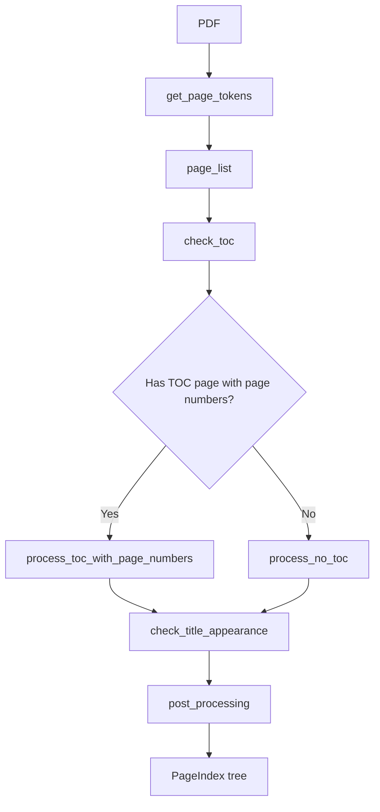
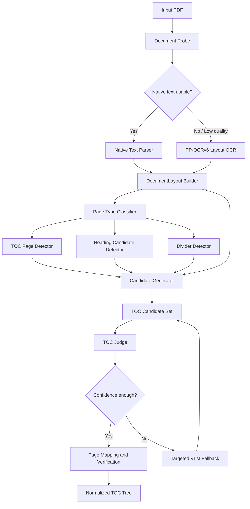
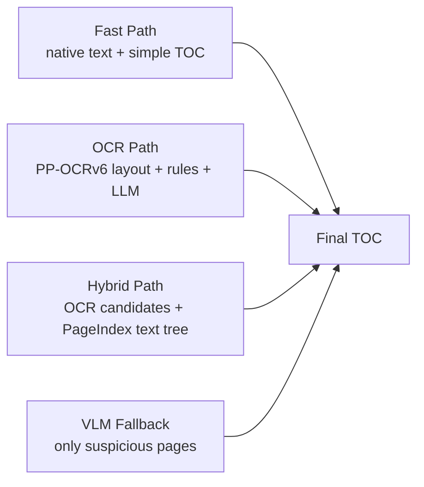
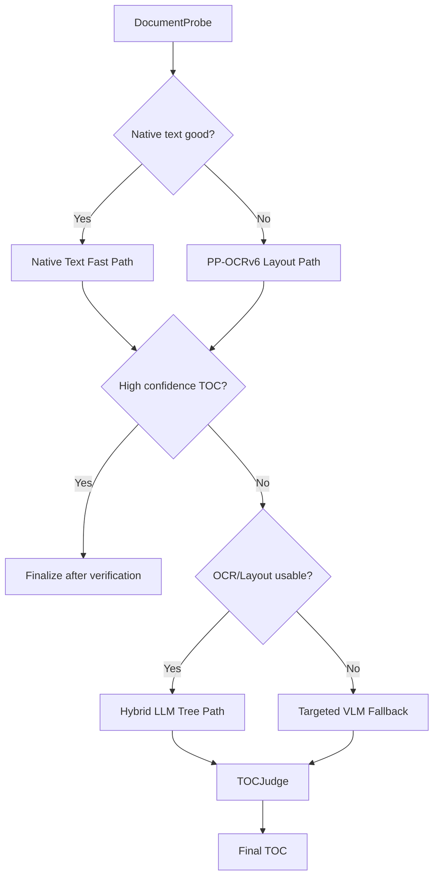

# TOC Generation Architecture

## 1. Executive Summary

本文档设计一套新的 PDF TOC 生成架构，目标是在复杂真实文档中同时提升准确率、性能和成本效率。

现有官方 PageIndex 开源实现适合文本质量较好的 PDF。它的核心优势是简洁的树构建流程：从 `page_list` 出发，检测目录页，调用 LLM 生成目录树，再做页码校验和后处理。但它依赖标准 PDF 文本解析，对扫描件、乱码 PDF、复杂版式 PDF 不够稳定。

当前项目实现了更多工程化路径，包括文本抽取、目录页抽取、章节分隔页识别、OCR 和 VLM fallback。但目前最大的问题是：扫描件或乱码文档容易过早进入 VLM 路径，导致成本高、延迟高，而且 VLM 输出仍然需要大量后处理修正。

新的推荐方向是：

```text
PP-OCRv6 / Layout first, LLM second, VLM last resort.
```

也就是说：

- 让 OCR 负责识别文字和版面坐标。
- 让规则和坐标算法负责抽取强结构。
- 让 LLM 负责弱结构理解、标题归纳和层级补全。
- 让 VLM 只处理 OCR/Layout/LLM 都无法稳定解决的疑难视觉场景。

核心架构从单一路径选择升级为多候选生成与仲裁：

```text
PDF
  -> 快速探测
  -> 结构化 OCR/Layout
  -> 多候选 TOC 生成
  -> 候选质量仲裁
  -> 页码映射与验证
  -> 标准 TOC 输出
```

这套设计不要求完全替换官方 PageIndex 或当前实现，而是把它们放在更清晰的分层中复用。

## 2. Design Goals

### 2.1 Accuracy

TOC 生成的准确率主要由四类指标决定：

- 标题是否完整：不能漏掉一级章节、关键二级章节。
- 层级是否正确：一级、二级、三级标题不能混乱。
- 页码是否正确：`physical_index` 要指向真实内容起始页。
- 边界是否合理：章节开始和结束页不能大范围漂移。

新架构要避免把“文字识别”“版面理解”“层级构建”“页码映射”混在一个模型调用里完成。每一层只做自己最擅长的判断，并把置信度传递给下一层。

### 2.2 Performance

性能目标不是所有路径都最快，而是让大部分文档走低延迟路径：

- 文本型 PDF 不做全文 OCR。
- 有明确目录页的 PDF 不做全文 VLM。
- 扫描件优先使用 OCR，而不是 VLM。
- 长文档先生成候选标题，再把压缩后的结构交给 LLM。

### 2.3 Cost

成本控制原则：

- 规则和 PDF 原生解析优先。
- OCR 优先于 VLM。
- 小模型/专用模型优先于大模型。
- 局部页面处理优先于全文处理。
- 多候选仲裁优先于反复让大模型重新生成。

### 2.4 Explainability

每个最终 TOC 结果都应该包含来源信息：

```json
{
  "source": "toc_page_layout",
  "confidence": 0.91,
  "evidence": {
    "toc_pages": [3, 4],
    "offset": 2,
    "title_match_rate": 0.86,
    "page_monotonic": true
  }
}
```

这可以帮助调试，也可以支撑产品侧向用户解释为什么某个目录可信或不可信。

## 3. Existing Implementations

### 3.1 Official PageIndex

官方开源实现的关键流程位于：

```text
D:\projects\PageIndex\pageindex\page_index.py
```

核心函数包括：

- `page_index_main`
- `tree_parser`
- `check_toc`
- `process_no_toc`
- `process_toc_with_page_numbers`
- `verify_toc`

简化流程如下：



优点：

- 流程清晰，容易理解和维护。
- 对文本型 PDF 效果较好。
- `process_no_toc` 的全文建树能力有价值。
- `process_toc_with_page_numbers` 的 offset 计算和页码修正思路值得复用。

缺点：

- 依赖 `get_page_tokens` 的文本质量。
- 无法充分利用 OCR 坐标、字号、缩进、右对齐页码等版面信息。
- 对扫描件、乱码 PDF、复杂报告、PPT 转 PDF 不稳定。
- LLM 在缺少结构化输入时容易把正文摘要误判成标题。

结论：

官方实现适合作为 `TextTreeBuilder` 组件复用，但不应继续作为所有文档的入口。

### 3.2 Current Project Implementation

当前项目关键文件包括：

```text
D:\projects\page_chat\backend\pageindex\router.py
D:\projects\page_chat\backend\pageindex\toc_page_extractor.py
D:\projects\page_chat\backend\pageindex\balanced_toc.py
D:\projects\page_chat\backend\app\services\ocr_service.py
D:\projects\page_chat\backend\app\services\pageindex_service.py
```

当前路由中，`image_only` 或 `garbled` 文档会直接进入 `visual` 路径：

```text
image_only / garbled -> visual
```

这在没有强 OCR 能力时是合理兜底，但在 PP-OCRv6 效果较好的前提下，就不是最优路径。

当前实现的优点：

- 已有多路径抽取框架。
- 已有 TOC 页坐标抽取和正则 fallback。
- 已有 balanced 模式、OCR 验证、divider 修复和 VLM 兜底。
- 工程上已经处理了很多真实文档的异常情况。

当前实现的问题：

- OCR 结果没有统一升级成结构化 Layout 层。
- VLM 路径承担了过多本该由 OCR/Layout 完成的职责。
- 路由是单候选选择，缺少多个候选结果的统一仲裁。
- 质量评估分散在不同路径中，难以横向比较结果。

结论：

当前实现有大量可复用经验，但需要把 OCR/Layout、候选生成、质量仲裁、VLM fallback 重新分层。

## 4. Proposed Architecture

### 4.1 Global Architecture



这个架构的核心思想是：先建立统一的文档表示，再在这个表示上生成多个候选 TOC，最后统一评分和验证。

### 4.2 Runtime Path Overview



四条路径不是互斥的“单选题”，而是按成本逐级启动：

1. Fast Path 尝试低成本解析。
2. OCR Path 为扫描件和低质量文本提供结构化输入。
3. Hybrid Path 把 OCR 结果转换为增强 `page_list`，复用 PageIndex 建树能力。
4. VLM Fallback 只处理低置信度页面或冲突区域。

## 5. Core Data Model

### 5.1 DocumentLayout

`DocumentLayout` 是新架构的核心中间层。

```json
{
  "doc_id": "xxx",
  "page_count": 120,
  "source_type": "native_pdf | ocr | hybrid",
  "pages": []
}
```

它解决的问题是：不管输入来自原生 PDF、PP-OCRv6 还是其他 OCR，都统一成同一种页面结构。

### 5.2 OCRLayoutPage

```json
{
  "page": 1,
  "width": 1684,
  "height": 2380,
  "plain_text": "第一章 总则\n...",
  "lines": [],
  "features": {
    "line_count": 32,
    "median_line_height": 28,
    "text_density": 0.34,
    "large_text_ratio": 0.08,
    "centered_line_ratio": 0.12,
    "right_aligned_number_count": 5,
    "toc_score": 0.76,
    "divider_score": 0.12,
    "content_score": 0.81
  }
}
```

页面级特征用于判断页面类型：

- `toc_score`：是否像目录页。
- `divider_score`：是否像章节分隔页。
- `content_score`：是否像正文页。
- `right_aligned_number_count`：是否有目录页常见的右侧页码。

### 5.3 OCRLayoutLine

```json
{
  "text": "1.2 技术路线",
  "score": 0.998,
  "box": [120, 320, 640, 358],
  "poly": [[120, 320], [640, 320], [640, 358], [120, 358]],
  "x0": 120,
  "y0": 320,
  "x1": 640,
  "y1": 358,
  "width": 520,
  "height": 38,
  "x_center": 380,
  "y_center": 339,
  "font_size_proxy": 38,
  "height_ratio": 1.42,
  "indent_level": 1,
  "is_centered": false,
  "is_right_aligned": false,
  "numbering": "1.2"
}
```

PP-OCRv6 输出中没有真实字体大小，但 `rec_boxes` 或 `rec_polys` 的高度可以作为 `font_size_proxy`。这个值不能表示真实字号，但足以参与标题层级判断。

### 5.4 TOCCandidate

```json
{
  "candidate_id": "toc_page_layout_001",
  "source": "toc_page_layout",
  "cost_level": "low | medium | high",
  "items": [],
  "evidence": {},
  "raw_confidence": 0.88
}
```

候选结果不直接作为最终结果，而是进入 `TOCJudge`。

### 5.5 TOCItem

```json
{
  "title": "技术路线",
  "structure": "1.2",
  "page": 15,
  "physical_index": 17,
  "level": 2,
  "source_page": 3,
  "bbox": [120, 320, 640, 358],
  "confidence": 0.91,
  "nodes": []
}
```

建议保留 `page` 和 `physical_index`：

- `page` 表示目录页上看到的逻辑页码。
- `physical_index` 表示 PDF 物理页。

很多真实文档存在封面、前言、目录页、罗马页码，因此二者不能混用。

## 6. Component Design

### 6.1 DocumentProbe

职责：

- 判断文档是否有可用原生文本。
- 判断文本是否乱码。
- 估计页数、文本覆盖率、平均字符数。
- 快速检测是否存在目录页关键词。

输入：

```text
PDF path
```

输出：

```json
{
  "page_count": 120,
  "native_text_coverage": 0.82,
  "is_image_only": false,
  "is_garbled": false,
  "possible_toc_pages": [3, 4],
  "recommended_first_path": "native_text"
}
```

设计要点：

- 只做低成本探测，不做重模型调用。
- 探测结果不能直接决定最终结果，只决定下一步优先级。

### 6.2 NativeTextParser

职责：

- 从 PDF 原生文本中提取 page text。
- 尽可能保留行级信息。
- 如果能拿到坐标，也转成 `OCRLayoutLine` 相同结构。

适用场景：

- 可复制文本 PDF。
- 文字覆盖率高。
- 乱码率低。

风险：

- PDF 内部文本顺序可能和视觉阅读顺序不一致。
- 表格、双栏、页眉页脚容易干扰标题判断。

### 6.3 PPOCRLayoutEngine

职责：

- 调用 PP-OCRv6。
- 解析 `rec_texts`、`rec_scores`、`rec_boxes`、`rec_polys`。
- 生成结构化 `OCRLayoutPage`。

PP-OCRv6 示例字段：

```json
{
  "rec_texts": ["智赋渝州", "数领未来"],
  "rec_scores": [0.9877, 0.9991],
  "rec_boxes": [[402, 181, 1161, 368], [503, 356, 1271, 535]],
  "rec_polys": []
}
```

需要派生的字段：

- 行高：`y1 - y0`
- 宽度：`x1 - x0`
- 中心点：`(x0 + x1) / 2`
- 相对字号：`height / median_line_height`
- 缩进：`x0` 分桶
- 右对齐：`x1` 是否接近页面右边界
- 居中：`x_center` 是否接近页面中心线

设计要点：

- OCR 不是只返回纯文本，而是返回版面结构。
- OCR 失败不能直接失败整个 TOC 流程，要降级到原生文本或 VLM。
- OCR 置信度要参与最终 TOC 评分。

### 6.4 DocumentLayoutBuilder

职责：

- 合并原生文本解析结果和 OCR 结果。
- 统一页面、行、坐标、文本、置信度。
- 清理页眉页脚、页码、重复水印。
- 计算页面级 layout features。

典型清理逻辑：

- 多页重复出现在同一 y 区域的短文本，可能是页眉页脚。
- 单独右下角数字，可能是页码。
- 置信度低且长度短的孤立行，可以降低权重。

### 6.5 PageTypeClassifier

职责：

为每页打标签：

```text
cover
toc
preface
divider
content
appendix
noise
```

TOC 页特征：

- 包含 `目录`、`CONTENTS`、`目 录`、`Table of Contents` 等关键词。
- 多行右侧页码。
- 中间有点线或明显标题-页码结构。
- 行之间 y 间距规律。
- 左侧有缩进层级。

Divider 页特征：

- 文本行少。
- 大字号、居中。
- 上下留白大。
- 常见模式如 `第一章`、`Chapter 1`、`Part 01`。

正文页特征：

- 文本密度高。
- 行数多。
- 标题行和正文行混合。

### 6.6 TOCPageLayoutExtractor

职责：

- 从目录页中提取标题、层级、逻辑页码。
- 基于坐标识别目录项。
- 比正则更稳定地处理点线、缩进、多级目录。

主要算法：

1. 过滤目录页标题行，例如 `目录`、`CONTENTS`。
2. 按 y 坐标合并同一行。
3. 检测右侧页码列。
4. 将左侧文本和右侧页码配对。
5. 根据缩进、编号、字号推断层级。
6. 输出 TOC 候选。

适合处理：

- 标准目录页。
- 扫描版目录页。
- PDF 文本顺序错乱但视觉布局清楚的目录页。

不适合处理：

- 没有目录页的文档。
- 图片式章节导航但无明确页码的文档。

### 6.7 HeadingCandidateDetector

职责：

从全文页面中识别潜在标题。

标题候选特征：

- 字号代理明显大于正文中位数。
- 行文本较短。
- 前后有较大空白。
- 符合编号模式：`1`、`1.1`、`第一章`、`（一）`、`Chapter 1`。
- 居中或左缩进稳定。
- 后续页面正文中存在标题展开内容。

输出：

```json
{
  "title": "应用场景建设情况",
  "page": 12,
  "level_guess": 1,
  "features": {
    "height_ratio": 1.8,
    "numbering": "一",
    "centered": true,
    "blank_before": 120
  }
}
```

### 6.8 TextTreeBuilder

职责：

- 复用官方 PageIndex 的 LLM 建树能力。
- 输入不再是低质量 raw page text，而是增强后的 `page_list`。

增强 `page_list` 示例：

```text
<physical_index_12>
[HEADING_CANDIDATE level=1 score=0.91] 第一章 总则
本章正文...
<physical_index_12>
```

这样 LLM 不需要从纯正文里猜标题，而是在候选提示下完成结构归纳。

适用场景：

- 没有明确目录页。
- 目录页缺失页码。
- 标题结构存在于正文中。
- OCR 文本质量较好，但层级需要语义判断。

### 6.9 TOCJudge

职责：

统一评估多个 TOC 候选，选择最可信结果。

建议评分公式：

```text
final_score =
  title_presence_score * 0.30
+ page_monotonic_score  * 0.20
+ hierarchy_score       * 0.20
+ toc_page_evidence     * 0.15
+ ocr_confidence_score  * 0.10
- cost_penalty          * 0.05
```

评分维度说明：

- `title_presence_score`：TOC 中标题能否在对应物理页或附近窗口找到。
- `page_monotonic_score`：页码是否整体递增。
- `hierarchy_score`：层级编号是否连续、合理。
- `toc_page_evidence`：是否有目录页、右侧页码、缩进等强证据。
- `ocr_confidence_score`：OCR 平均置信度和低置信度行比例。
- `cost_penalty`：同等质量下优先选择低成本路径。

### 6.10 PageMappingVerifier

职责：

- 将逻辑页码映射到 PDF 物理页。
- 修正封面、前言、目录页导致的页码偏移。
- 验证标题是否出现在目标页附近。

核心方法：

1. 从目录项中取前若干个带页码标题。
2. 在目录页之后的窗口中查找标题。
3. 得到 `logical_page -> physical_index` 样本对。
4. 计算 offset。
5. 应用 offset。
6. 对所有标题做窗口验证。

注意：

- 不能只用一个样本算 offset，至少需要多个一致样本。
- 如果样本冲突，要降低候选分数，而不是强行修复。

### 6.11 TargetedVLMFallback

职责：

只在必要时调用 VLM。

触发条件：

- OCR 平均置信度低。
- TOCJudge 最高分低于阈值。
- 多个候选结果强冲突。
- 页面是强视觉设计，例如海报式章节页、PPT 转 PDF、复杂信息图。
- OCR 文本存在但阅读顺序严重错乱。

调用范围：

- 只调用候选 TOC 页。
- 只调用章节分隔页。
- 只调用冲突标题附近页面。
- 避免全文 VLM。

输出仍然要进入 `TOCJudge`，而不是直接作为最终结果。

## 7. Routing Strategy

### 7.1 Recommended Route Order



### 7.2 Route Decision Table

| Document condition | First route | Fallback |
| --- | --- | --- |
| Native text good, TOC page found | TOC page text/layout extraction | LLM tree |
| Native text good, no TOC page | TextTreeBuilder | OCR heading detection |
| Image-only PDF | PP-OCRv6 Layout | VLM suspicious pages |
| Garbled PDF | PP-OCRv6 Layout | VLM suspicious pages |
| Scanned TOC page | OCR TOCPageLayoutExtractor | VLM TOC page |
| PPT-style PDF | OCR divider + heading detection | VLM divider pages |
| Long report without TOC | Heading candidates + LLM tree | targeted VLM |
| Very poor OCR quality | Targeted VLM | low-confidence result |

### 7.3 Important Change

旧逻辑：

```text
image_only / garbled -> visual
```

新逻辑：

```text
image_only / garbled -> ppocr_layout -> toc_page_layout / heading_candidates / llm_tree -> visual fallback
```

这会显著降低 VLM 调用量。

## 8. End-to-End Examples

本节用几个典型文档说明新架构如何运行。

### 8.1 Native Text PDF with TOC Pages

输入特征：

- PDF 可复制文本。
- 前几页存在 `目录`。
- 目录页中有标题和页码。

执行流程：

```text
DocumentProbe
  -> NativeTextParser
  -> DocumentLayoutBuilder
  -> TOCPageLayoutExtractor
  -> PageMappingVerifier
  -> TOCJudge
  -> Final TOC
```

这个场景通常不需要 OCR，也不需要 VLM。LLM 只在目录层级不清晰或页码缺失时补充使用。

### 8.2 Scanned PDF with TOC Pages

输入特征：

- 原生文本覆盖率低。
- 页面是扫描图。
- 目录页视觉结构清晰。

执行流程：

```text
DocumentProbe
  -> PPOCRLayoutEngine
  -> DocumentLayoutBuilder
  -> PageTypeClassifier
  -> TOCPageLayoutExtractor
  -> PageMappingVerifier
  -> TOCJudge
  -> Final TOC
```

这个场景是 PP-OCRv6 最有价值的地方。只要 OCR 能稳定输出文字和坐标，目录页抽取不需要 VLM。

### 8.3 PDF without TOC Pages

输入特征：

- 没有明确目录页。
- 正文中有章节标题。
- 标题可能有编号，也可能没有编号。

执行流程：

```text
DocumentProbe
  -> NativeTextParser or PPOCRLayoutEngine
  -> HeadingCandidateDetector
  -> TextTreeBuilder
  -> PageMappingVerifier
  -> TOCJudge
  -> Final TOC
```

这里 LLM 的价值更高，因为它需要从候选标题中判断哪些是主章节、哪些是子章节、哪些只是正文强调文本。

### 8.4 PPT-style or Visual-heavy PDF

输入特征：

- 每页文字少。
- 标题可能是图片化艺术字。
- 章节页依赖视觉布局。

执行流程：

```text
DocumentProbe
  -> PPOCRLayoutEngine
  -> DividerDetector
  -> HeadingCandidateDetector
  -> TOCJudge
  -> TargetedVLMFallback
  -> Final TOC
```

注意这里仍然不是全文 VLM，而是优先让 OCR 和 divider detector 找到疑似章节页，再把低置信度页面交给 VLM。

## 9. Component Input and Output Summary

| Component | Input | Output | Main value |
| --- | --- | --- | --- |
| DocumentProbe | PDF | probe result | 低成本判断文档类型 |
| NativeTextParser | PDF | page text / line text | 处理文本型 PDF |
| PPOCRLayoutEngine | page images | OCRLayoutPage | 处理扫描件和乱码 PDF |
| DocumentLayoutBuilder | native text / OCR result | DocumentLayout | 统一文档结构 |
| PageTypeClassifier | DocumentLayout | page labels | 区分目录、正文、分隔页 |
| TOCPageLayoutExtractor | TOC pages | TOCCandidate | 从目录页抽取结构 |
| HeadingCandidateDetector | all pages | heading candidates | 从正文发现标题 |
| TextTreeBuilder | enhanced page_list | TOCCandidate | 用 LLM 构建弱结构目录 |
| TOCJudge | candidates | ranked candidate | 多候选仲裁 |
| PageMappingVerifier | candidate + pages | verified TOC | 页码映射和标题验证 |
| TargetedVLMFallback | suspicious pages | TOCCandidate | 处理疑难视觉场景 |

## 10. Accuracy Strategy

### 10.1 Use Layout Signals Before Semantics

TOC 是一种强版面结构，很多信息不需要 LLM 理解：

- 右侧页码列。
- 左侧缩进层级。
- 点线连接。
- 标题行高度。
- 目录页连续性。

这些应优先由规则和坐标算法解决。

### 10.2 Use LLM for Ambiguous Structure

LLM 适合处理：

- 标题语义归纳。
- 无编号标题的层级判断。
- 多页标题候选的合并。
- 没有目录页时的章节树构建。

LLM 不应承担：

- OCR 字符识别。
- 基础坐标判断。
- 大量页码 offset 计算。
- 明确规则可完成的目录项切分。

### 10.3 Use VLM for Visual Exceptions

VLM 适合处理：

- OCR 漏掉图形化标题。
- 复杂版式中的阅读顺序判断。
- 图片化目录页。
- PPT 风格章节页。
- 多栏文档的视觉层级判断。

VLM 不适合作为默认路径，因为成本和延迟都高，而且输出结构仍需要校验。

## 11. Performance Strategy

### 11.1 Lazy OCR

不要一开始就全文 OCR。

推荐顺序：

1. 前 5-10 页 OCR 探测。
2. 如果检测到 TOC 页，只 OCR TOC 页和后续少量内容页。
3. 如果是扫描件且没有目录页，再全文 OCR。
4. 长文档按页批处理，缓存 OCR 结果。

### 11.2 Candidate Compression

不要把全文 OCR 原文直接喂给 LLM。

更好的输入：

```text
page_index
plain_text_excerpt
heading_candidates
layout_features
toc_page_evidence
```

这能显著减少 token，同时提高 LLM 判断质量。

### 11.3 Parallelizable Stages

可并行阶段：

- OCR 页面批处理。
- 页面特征计算。
- 标题候选检测。
- 标题出现验证。
- 多候选评分。

不可过度并行阶段：

- LLM 长上下文建树。
- VLM 调用。
- 需要全局 offset 的页码映射。

## 12. Cost Strategy

### 12.1 Cost Tier

| Tier | Component | Cost | Use case |
| --- | --- | --- | --- |
| 0 | PDF native parser | Very low | 文本 PDF |
| 1 | Rules/layout heuristics | Very low | 目录页、标题候选 |
| 2 | PP-OCRv6 | Low/medium | 扫描件、乱码 PDF |
| 3 | LLM text tree | Medium | 弱结构理解 |
| 4 | VLM | High | 疑难视觉兜底 |

### 12.2 Cost Budget Policy

建议每个文档维护运行预算：

```json
{
  "max_ocr_pages": 120,
  "max_vlm_pages": 8,
  "max_llm_tokens": 60000,
  "prefer_low_cost_when_score_diff_lt": 0.03
}
```

当两个候选分数接近时，优先低成本候选。

## 13. Failure Handling

### 13.1 Common Failure Cases

| Failure | Cause | Handling |
| --- | --- | --- |
| TOC 页识别错误 | 前言/摘要像目录 | 用右侧页码列和标题匹配验证 |
| 页码 offset 错 | 封面/目录/罗马页码 | 多样本 offset 验证 |
| 层级混乱 | 缩进不稳定或编号缺失 | LLM tree refinement |
| OCR 漏字 | 图片低清晰度 | 局部 VLM |
| 正文标题误判 | 大号强调文本 | 标题出现位置和后续内容验证 |
| PPT 页误判正文 | 行数少、视觉强 | divider detector + VLM |

### 13.2 Degraded Output

如果无法高置信度生成完整 TOC，可以返回降级结果：

```json
{
  "status": "low_confidence",
  "toc_items": [],
  "reason": "OCR quality too low and no reliable title-page mapping",
  "suggested_action": "manual review or VLM full fallback"
}
```

不要输出看似完整但实际不可信的目录。

## 14. Evaluation Plan

### 14.1 Test Set

至少准备以下类型：

- 原生文本 PDF，有目录页。
- 原生文本 PDF，无目录页。
- 扫描 PDF，有目录页。
- 扫描 PDF，无目录页。
- PPT 转 PDF。
- 政府报告。
- 论文。
- 招股书/年报。
- 多栏文档。
- 中英文混排文档。
- 页码存在罗马数字或前言页的文档。

### 14.2 Metrics

准确率指标：

- 一级标题召回率。
- 二级标题召回率。
- 标题精确率。
- 层级准确率。
- `physical_index` 准确率。
- 章节边界准确率。

性能指标：

- 总耗时。
- 首个可用结果耗时。
- OCR 页数。
- LLM token 数。
- VLM 调用页数。

成本指标：

- 单文档平均成本。
- 不同路径成本分布。
- VLM 触发率。

稳定性指标：

- 失败率。
- 低置信度返回率。
- 多候选冲突率。

## 15. Migration Plan

### Phase 1: Introduce Layout Layer

目标：

- 新增 `DocumentLayout`、`OCRLayoutPage`、`OCRLayoutLine`。
- 接入 PP-OCRv6 JSON。
- 从 `rec_boxes` 推导行高、字号代理、缩进、右对齐。
- 先不替换现有 pipeline，只旁路记录结果。

验收：

- 能把 PP-OCRv6 输出稳定转成结构化 layout。
- 能识别封面页、目录页、正文页的基础特征。

### Phase 2: Replace Early Visual Routing

目标：

- 将 `image_only/garbled -> visual` 改成 `image_only/garbled -> ppocr_layout`。
- 在 OCR layout 质量足够时回到文本/目录页路径。
- VLM 只作为 fallback。

验收：

- 扫描 PDF 的 VLM 调用量明显下降。
- TOC 准确率不低于当前 visual 默认路径。

### Phase 3: OCR TOC Page Extractor

目标：

- 基于 OCR 坐标实现目录页抽取。
- 复用现有 `toc_page_extractor.py` 的质量检查、offset、层级构建思路。

验收：

- 扫描目录页能稳定抽出标题和页码。
- 目录页右侧页码识别准确。

### Phase 4: Candidate Judge

目标：

- 引入 `TOCJudge`。
- 统一比较 text、ocr、llm、vlm 候选。
- 输出候选评分和证据。

验收：

- 同一文档可观察每个候选的得分。
- 错误结果可追踪到具体评分维度。

### Phase 5: Evaluation and Tuning

目标：

- 建立固定评测集。
- 每次改动输出准确率、耗时、成本变化。
- 调整路由阈值和评分权重。

验收：

- 能量化证明新架构优于当前实现。

## 16. Recommended Final Shape

长期来看，推荐系统边界如下：

```text
backend/pageindex/
  layout/
    document_layout.py
    ppocr_parser.py
    native_text_parser.py
    feature_extractor.py

  classifiers/
    page_type_classifier.py
    toc_page_detector.py
    divider_detector.py

  candidates/
    toc_page_layout_extractor.py
    heading_candidate_detector.py
    text_tree_builder.py
    vlm_candidate_extractor.py

  judge/
    toc_judge.py
    page_mapping_verifier.py
    confidence.py

  pipeline/
    toc_generation_pipeline.py
    routing_policy.py
```

这比当前把大量逻辑集中在 `balanced_toc.py` 更容易维护，也更适合测试。

## 17. Final Recommendation

最推荐的目标架构不是“官方 PageIndex vs 当前项目 vs VLM”的三选一，而是把它们重新放到正确位置：

```text
PP-OCRv6:
  负责文字识别和版面坐标，是扫描件和乱码 PDF 的第一入口。

Layout rules:
  负责目录页、页码列、缩进、字号代理、章节分隔页等强结构。

PageIndex-style LLM tree:
  负责从增强 page_list 中生成层级目录树。

Current balanced logic:
  作为真实文档修复经验库继续复用，但逐步拆成独立组件。

VLM:
  作为疑难视觉页面的局部 fallback，而不是默认路径。
```

这套架构的关键收益：

- 准确率更高：结构化 OCR/Layout 给 LLM 更好的输入。
- 性能更好：多数文档不需要 VLM。
- 成本更低：昂贵模型只处理少量疑难页。
- 可维护性更强：每个组件职责清晰，可单独测试和替换。
